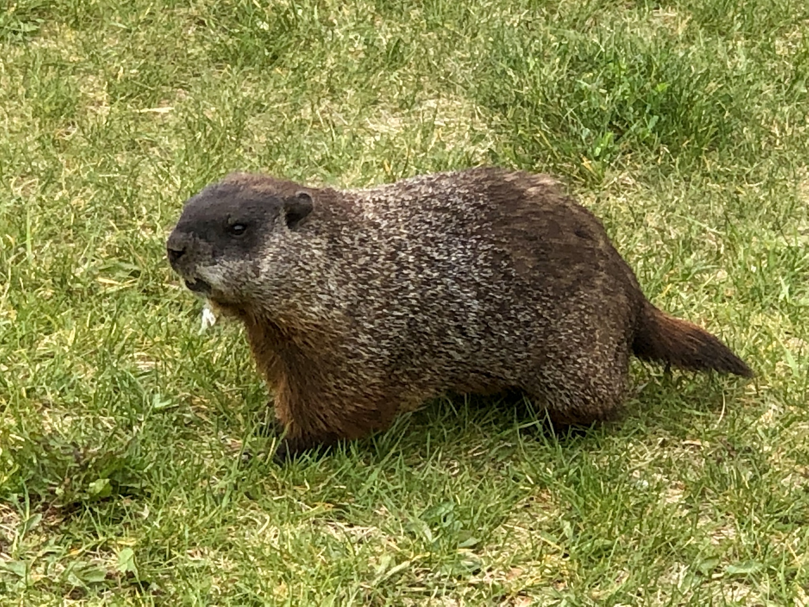

What is Project 366? Read more [here](https://thebirdsarecalling.com/2019/03/29/project-366/)!

Today’s picture is a contribution from my lovely better half and my sister-in-law. While going for a stroll in the MacKinnon park, right below the old Royal Alberta Museum, chatting about stuff that only better halfs and sister-in-laws chat about they came across this curious looking critter. I received a picture and a short video clip at work asking me what this critter is. To be completely honest, I had no clue what it could be. It looked somewhat similar to a marmot, but the only marmots I have ever seen were high up in the mountains, so I did not think it would be a marmot. It turns out that it is a marmot. Marmots are essentially large squirrels in the genus Marmota, with 15 species spread out throughout the northern hemisphere. One of the species is the Hoary Marmot (_Marmota caligata_) which I saw many years ago in Lake O’Hara. The fella in MacKinnon Park, however, is a Groundhog aka Woodchuck (_Marmota monax_) which is another species in the same genus. It turns out this particular Groundhog is somewhat of a local celebrity and has even been featured as a [news story on CBC](https://www.google.com/amp/s/www.cbc.ca/amp/1.2632236). Apparently people are regularly feeding it and it is obvious that it is very comfortable around humans. It is quite regrettable that people do not have the sensibility to treat wildlife, even urbanized wildlife, appropriately. Groundhogs are known to have an [aggressive nature](https://www.nytimes.com/2007/01/12/nyregion/12groundhog.html?_r=1) so having one so comfortable around humans could potentially lead to trouble down the road.

_May the curiosity be with you. This is from “The Birds are Calling” blog ([www.thebirdsarecalling.com](http://www.thebirdsarecalling.com)). Copyright Mario Pineda._
