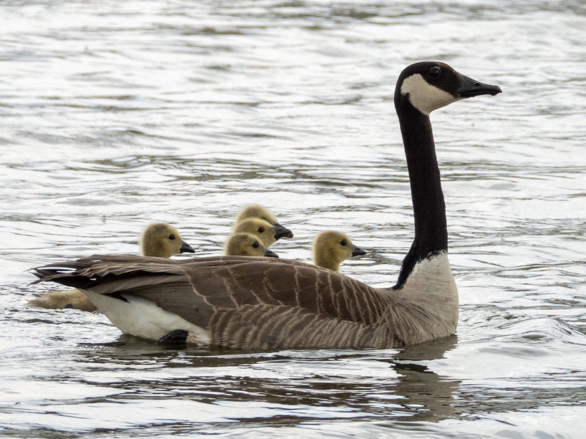

What is Project 366? Read more [here](https://thebirdsarecalling.com/2019/03/29/project-366/)!

I was at the Emerald Pond in Sherwood Park looking for charismatic birds such as pelicans. The pelicans were a no show, but there was plenty of Canada geese in the tall grass surrounding the pond. I did not pay much attention to the geese and as I was walking along the shore they kept a close eye on me and slowly, almost reluctantly, moved out of my way as I was approaching. As I approached one goose that appeared alone I noticed something else moving around in the grass right beside the goose. They were goslings and this would explain the slighly odd behaviour of the adult geese. The adult was herding the goslings towards the water’s edge while keeping its head high and its gaze fixed on me. As I started to scrutinize the other geese around the pond, now that I knew what to look for, I saw they all had little ones. The yellow goslings were remarkable well-camouflaged in the tall grass and obediently followed their moms and dads into the water. Once in the water the families quickly crossed the pond and got out of the water on the other side. I imagine the goslings might be safer in the tall grass as they would be easy prey for an opportunistic raptor in the open water.

Nikon P1000, 437mm @ 35mm, 1/500s, f/5, ISO 100

_May the curiosity be with you. This is from “The Birds are Calling” blog ([www.thebirdsarecalling.com](http://www.thebirdsarecalling.com)). Copyright Mario Pineda._
