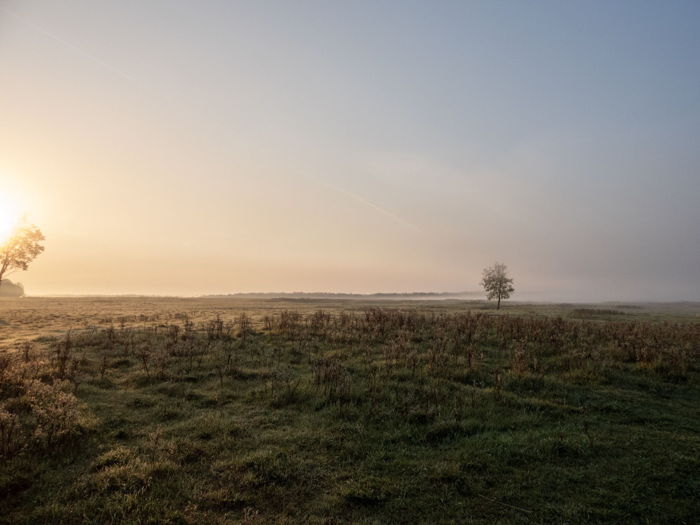

What is Project 366? Read more [here](https://thebirdsarecalling.com/2019/03/29/project-366/)!

The alarm clock went off at 5am. Fifteen minutes later I was heading East on a quiet and empty Yellowhead Highway, into the sunrise and towards Elk Island. Nature walks at dawn is a meditative experience. The dawn of a new day, the absence of humans and human made noises washes away stress, sleepiness and rejuvenates the mind. The absence of human-made sounds is made up for by a cacophony of natural sounds, primarily birds. Dawn is the time of day that birds are by far the most active and vocal. As I was approaching the park thick impenetrable fog shrouded the landscape forcing me to, at times, slow down to walking speed on the highway. I have not seen fog this thick in many years. It was the proverbial pea soup with visibility diminished to only a few meters. Once I arrived at Elk Island heavy fog banks covered the open fields and ponds. Not ideal for viewing or photographing wildlife, but magical nevertheless and quite inducing for landscape photography. After a quick scan of the fog covered Bison Loop I settled in at the Mud Lake parking lot to brew myself a cup of coffee and wait for the fog to lift. I spend the next few hours hiking along ponds and wetlands around Tawayik Lake seeing lots of waterfowl and industrious beavers.

Nikon P1000,24mm @ 35mm, 1/1000s, f/2.8, ISO 100

_May the curiosity be with you. This is from “The Birds are Calling” blog ([www.thebirdsarecalling.com](http://www.thebirdsarecalling.com)). Copyright Mario Pineda._
