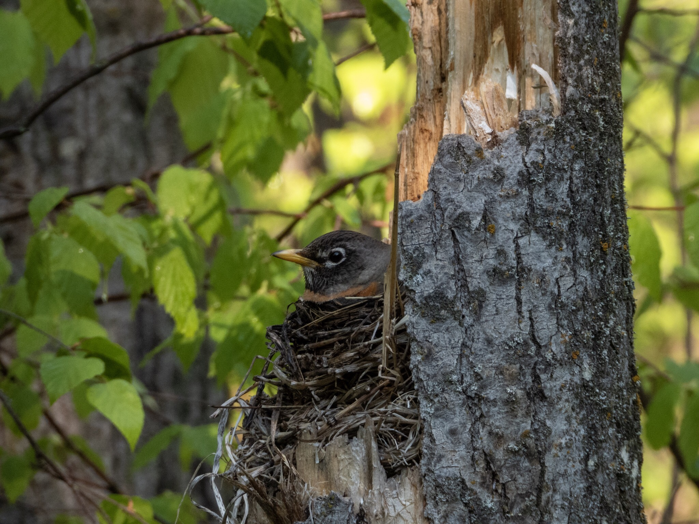

What is Project 366? Read more [here](https://thebirdsarecalling.com/2019/03/29/project-366/)!

Today’s post, #61, marks the completion of 1/6th of my Project 366. While it is far to premature to celebrate I am in a bit of disbelieve that I actually have managed to post every single day for the past two months. The biggest surprise has been that the writing and posting is not the main challenge but rather getting out into nature enough to have fresh pictures to accompany the posts. Now back to regular business...

During an early morning visit to Elk Island I came across an American Robin that had build its nest in a hollow tree stump. I was surprised that it had chosen such an exposed nesting location. The nest was about shoulder high right along a hiking trail and there really was no way one could miss it. While stayed on the opposite side of the trail from the nest the robin did not seem particularly phased. It sat completely still and the fact that it insisted on staying put rather than flying off could mean that there were eggs or young in the nest. This was one of those times were I was particularly appreciative of the extra long zoom capabilities of the P1000.

Nikon P1000, 605mm @ 35mm, 1/250s, f/5, ISO 400

_May the curiosity be with you. This is from “The Birds are Calling” blog ([www.thebirdsarecalling.com](http://www.thebirdsarecalling.com)). Copyright Mario Pineda._
