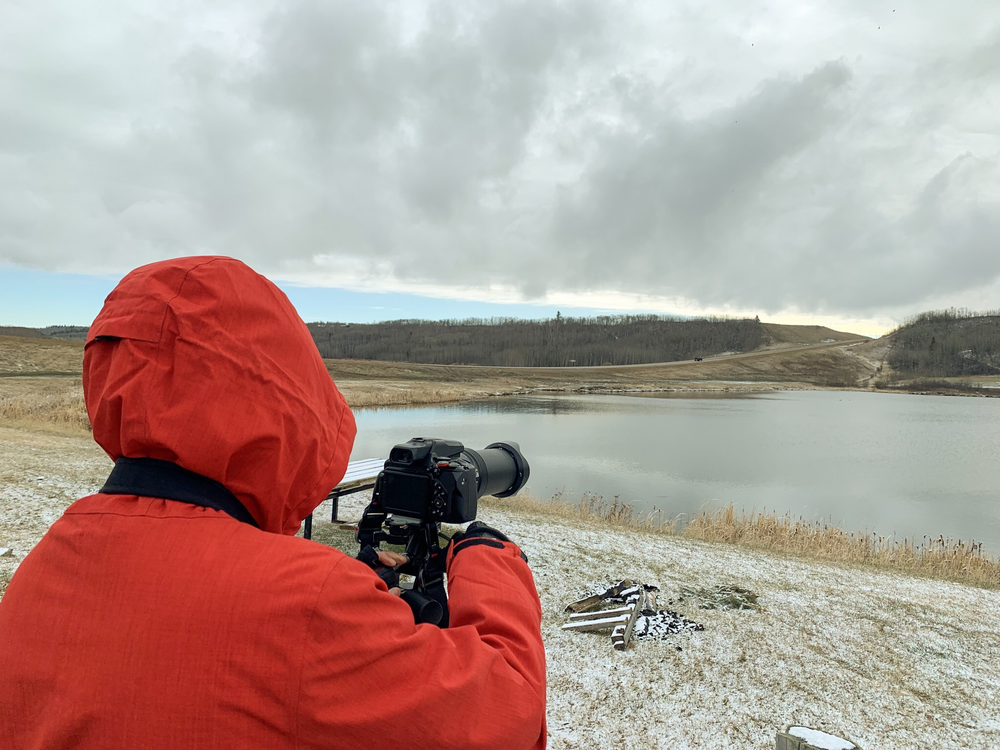
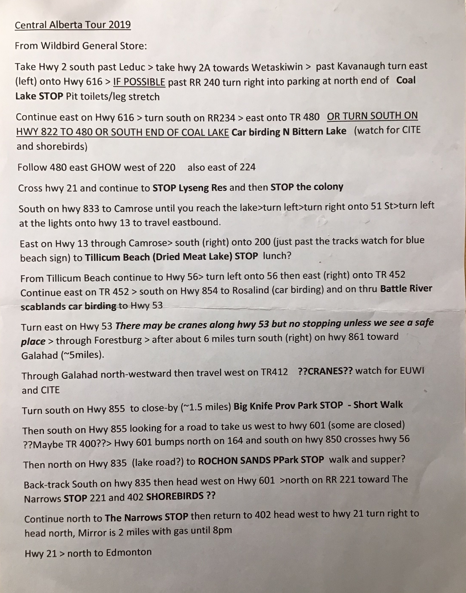
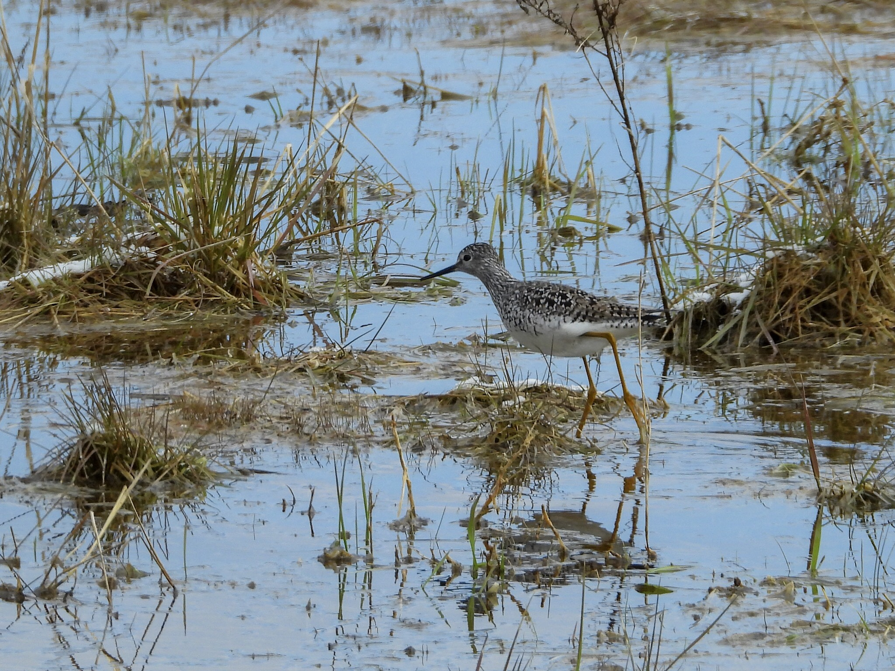
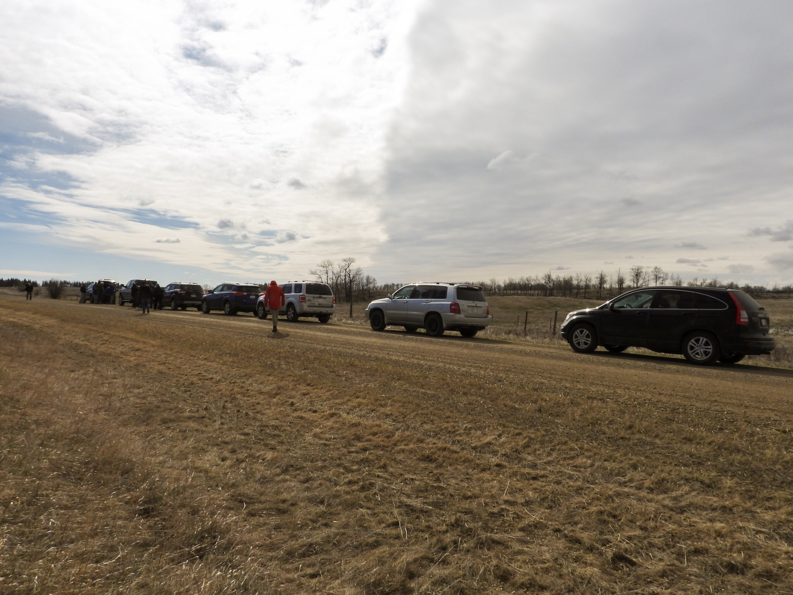
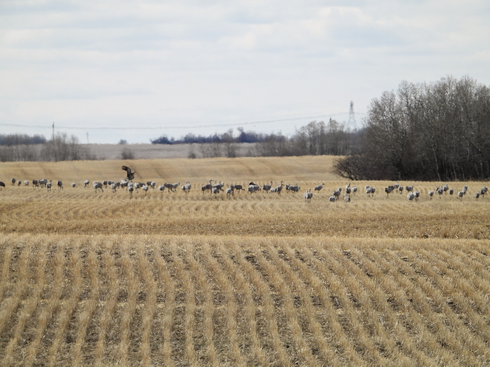

For the [Global Big Day of Birding](https://ebird.org/news/global-big-day-4-may-2019) on May 4 we joined the [Edmonton Nature Club](https://edmontonnatureclub.org/index.html) tour of central Alberta, an all day marathon of birding. There is an excellent [field trip report](http://enctripreports.blogspot.com/2019/05/global-may-big-day-of-birding.html) written up by field trip leader and I doubt I would do a better job at summarizing the day. I particularly like how she refers to the participants as “citizen scientists”. As it turns out, bird observations checklists submitted to eBird [are being used in research and conservation efforts](https://ebird.org/canada/news/connecting-regional-citizen-science-projects-with-ebird) providing information about species range, timing of migration and estimation of population sizes and trends. So there you have it. It all started with trying to get out into nature more, then it morphed into birdwatching, birding and photography and now I am contributing to science. Who knows where this adventure will end up taking me.

First stop of the day, a chilly Coal Lake.

A Big Day field trip is all about quantity and big numbers. We ended up driving almost 600 km and managed to see 80 different species of birds, of which 40 were lifers. For beginner birders like us this is an incredible learning opportunity. Yes, you are thrown in at the deep end and sometimes you sink. For example when seemingly everyone is awestruck by a bird in their binoculars while we cannot even find what they are looking at (happened several times). Yet others times you can say you saw a lifer, but you know that you would never be able to find it on your own, never mind identify it again. But you get to count it. On a Big Day everything happens at a hectic pace compared to the regular slow meandering nature walks I am used to. You do not get to spend much time with any of the birds or taking photographs because time watching one bird, is time lost scoring another bird. For us, it was about learning to identify new species, learning from the pros and scouting new birding locations for future field trips. We had lots of fun and we will definately be returning to many of the locations we visited during this tour de force of central Alberta.

Our planed itinerary was jam packed with lots of car birding and with the occasional short walk.

The Lyseng Reservoir was tucked in among stubble fields and Hutterite colonies and had an impressive diversity of water fowl and shore birds. Many of our lifers were found here.

A Lesser Yellowlegs at Lyseng Reservoir (Lifer #122, AB Big Year #72).

Birding convoy at Lyseng Reservoir.

One of the highlights were definitely the Sandhills Cranes. We encountered several large flocks grazing in the stubble fields. It was difficult to photograph them however as they very quite skittish. As soon as we stopped and got out of the car they started walking away from us although we were still quite a distance away.

Sandhill Cranes along Highway 53.

All in all it was a fun day, with lots of Birding action and supere productive in terms of seeing new species. I did not get an opportunity to photograph much as things just happened too fast and we never spend much time in one location before moving on.

_May the curiosity be with you. This is from “The Birds are Calling” blog ([www.thebirdsarecalling.com](http://www.thebirdsarecalling.com/)). Copyright Mario Pineda._
