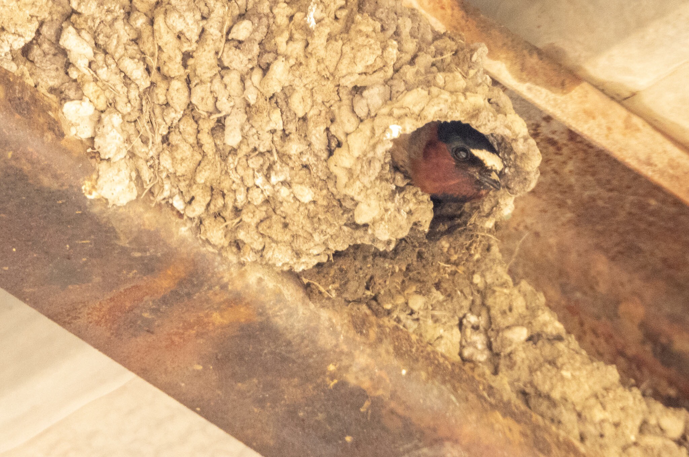

What is Project 366? Read more [here](https://thebirdsarecalling.com/2019/03/29/project-366/)!

Tucked away behind the visitors centre by the bison paddock at Elk Island National Park there is a large steel structure holding up a metal roof. It looks like it is being used for protecting materials and machines stored outdoors from rain and snow. On Google Maps one can see the large roof [here](https://goo.gl/maps/epw4cCABdd9yTR5L8). During a recent visit at the paddock I was walking around looking for bison. I barely noticed the structure until I came closer to it and all of a sudden a swarm of swallow-like birds emerged out of nowhere. The swallows seemed agitated and were swarming around me. It was reminiscent of scenes from Alfred Hitchcock’s The Birds. The reason for the commotion was soon obvious. The steel girders holding up the roof were covered in swallow nests. Most of them had swallows darting in and out and many were still under construction. There was quite a commotion with swallows peeking out of the nests, while others brought in the mud. I assume that these were breeding pairs that were building the nest together. It was quite a sight seeing these engineers of the bird world building their homes. In the picture one can see the darker wet mud that was recently added to the nest surrounded by the lighter dry mud. As I stood there admiring the swallows I completely forgot about the bison and it was not until I was about to leave that I realized that I had not yet identified the species. The only swallows I have seen to date in Canada are tree swallows and barn swallows and the bison paddock swallows seem to have features from both of these species, a white chest like a tree swallow and a bunch of rufous color on their head like a barn swallow. The white patch on their forehead, however, gave them away as Cliff Swallows (_[Petrochelidon pyrrhonota](https://ebird.org/species/cliswa)_, Lifer: #150, AB Big Year: #110).

_May the curiosity be with you. This is from “The Birds are Calling” blog ([www.thebirdsarecalling.com](http://www.thebirdsarecalling.com)). Copyright Mario Pineda._
