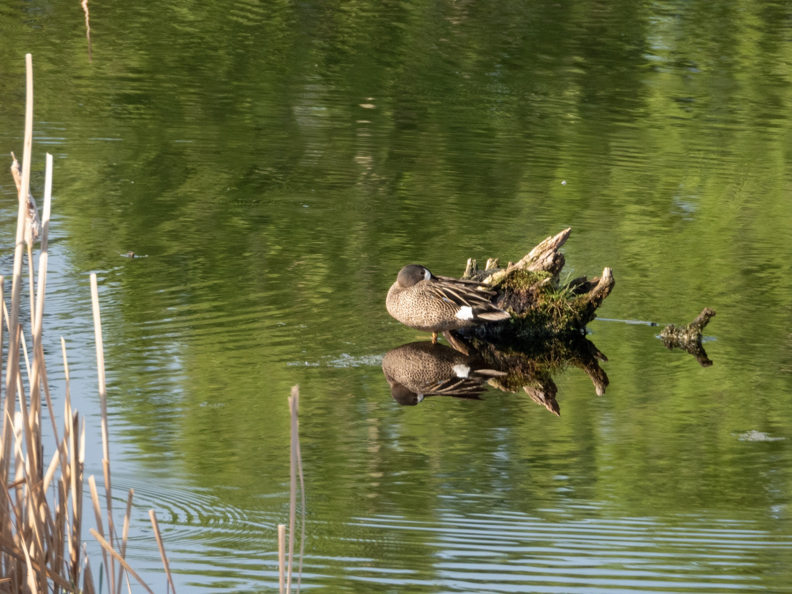

What is Project 366? Read more [here](https://thebirdsarecalling.com/2019/03/29/project-366/)!

In complete tranquility and at ease the Blue-winged Teal was resting on a submerged rock. If it would not be for the ever so subtle ripples on the water surface its reflection would have been indistinguishable from the real thing. The surface of the pond almost perfectly mirrored the waterfowls, the foliage of the surrounding forest, the reeds and the blue sky. It was a quiet and calm early morning with only the birds and beavers going about their business. The colours were vibrant and stunning with the emerald green foilage and the dark blue sky nestled together on the surface of the pond like a water colour painting. Unfortunately scenes like this are likely to become fleeting and elusive this summer and for the years to come. Fast forward less than a week and much of Alberta is covered in a grim post-apocalyptic yellow, smelly and impenetrable blanked of smoke. The smoke has drifted in from massive forest fires raging in northern Alberta. As of tonight the largest of the forest, the Chuckegg Creek fire, is over 500 000 acres in size, that is about 2300 square kilometres. The smoke is so thick that the street lights have turned on, their light sensors thinking it is evening time. [The Air Quality Health Index (AQHI) is at 72..., and that is on a ten point scale](https://twitter.com/jthompsonctv/status/1134287798410928129?s=21)..., let that sink in for a bit.

As climate change is going unchecked the forecasts are dire. All predictions [indicate that longer and more intensive fire seasons are here to stay](https://www.nytimes.com/interactive/2018/11/27/climate/wildfire-global-warming.html). Humanity has accomplished remarkable feats in the span of only a handful of lifetimes, proving that we are capable of astounding feats when we set our minds to it. Unfortunately we humans also suffer from a self-entered navel-gazing dysfunction that has made our society, our leaders and decision makers unwilling to grasp the severity of the situation. The smoke blanketing the capital of Alberta is particularly poignant as it conincides with our politicians in the legislature introducing a bill ([Bill 1: The Act to Repeal the Carbon Tax](https://www.google.com/amp/s/www.cbc.ca/amp/1.5155965)) at 12:01 today killing our already weak climate change initiative.

David Attenborough once said that “No one will protect what they don’t care about; and no one will care about what they have never experienced.”. I cannot imagine how anyone experiencing first hand the magic beauty of a Blue-winged Teal in repose in a emerald green lake under a dark blue morning sky could remain indifferent to the injustice that is being done.

_May the curiosity be with you. This is from “The Birds are Calling” blog ([www.thebirdsarecalling.com](http://www.thebirdsarecalling.com)). Copyright Mario Pineda._
