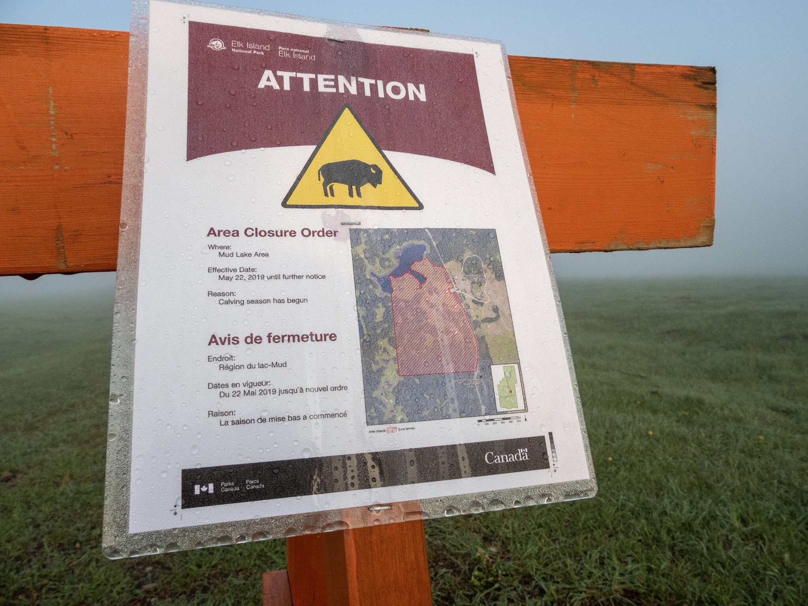

What is Project 366? Read more [here](https://thebirdsarecalling.com/2019/03/29/project-366/)!

Reliable intelligence indicates that the bisons at Elk Island National Park have had their calves. I have not had much luck finding bison over the last few months and things do not seem to improve. It is likely that the adult bison might be even shyer now that they have calves. During my last visit parts of the park had been shutdown to the public due to the calving, so that will likely not improve my bison viewing luck. Assuming the smoke from the wild fires clears I will be doing another dawn field trip to Elk Island this weekend, so wish me luck. If there is one thing wildlife watching has taught me is that crossing the path with wild animals takes good timing and no small amount of luck. Over the years I have had some very memorable run-ins with bison at Elk Island. The one that perhaps stands out the most in my mind is a bison stampede down the main access road involving around 30-50 bison charging down the road as we were driving the other way. Fortunately we were safely inside our car but as the bison passed us our vehicle was completely surrounded by bison hoofs and horns. It appears that memorable encounters are separated by long periods were no animals are encountered. Historically it has been the same situation with bears in the mountain parks. There are years were we do not see a single bear, only to have bears dropping out of trees all over the place the following summer. It takes patience and persistence, that is for sure. The rewards of viewing wildlife in their natural habitats are memories that last a life time.

Nikon P1000, 24mm @ 35mm, 1/800s, f/2.8, ISO 100

_May the curiosity be with you. This is from “The Birds are Calling” blog ([www.thebirdsarecalling.com](http://www.thebirdsarecalling.com)). Copyright Mario Pineda._
