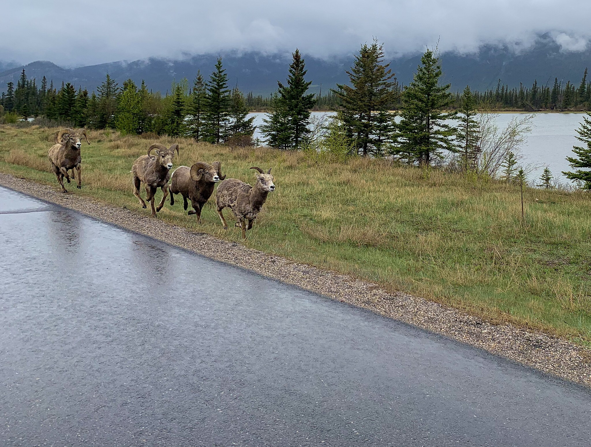

What is Project 366? Read more [here](https://thebirdsarecalling.com/2019/03/29/project-366/)!

We were on the road to Jasper National Park for a camping weekend in the mountains. It is always a special treat to head up into the mountains, but this time we were a bit apprehensive as the weather forecast looked quite gloomy with rain and cold temperatures. Sure enough, as soon as we went through the park gate the rain started coming down. It was, however, too late to turn back now. The road between the park gate and Jasper is scenic as it meanders its way through a valley following the Athabasca River with mountains and lakes surrounding us on either. The highway inside the park is limited to 90 km/h with a number 70 km/h sections. There are good reasons for this as animals often hang out around and on the highway. In the past we have seen coyotes, foxes, bears, elks and bighorn sheep right on this stretch of highway. As we were crossing an isthmus between the Athabasca River on the right and Talbot Lake on the left half-dozen of Bighorn Sheep came galloping towards us along the highway. This must have been a good omen, if you believe in such things, The weekend ended up turn out great. Yes it rained for the rest of the day. but the next two days were sunshine allowing us to do some awesome hikes and birding, including scoring two lifers: Yellow-rumpled Warbler (_[Setophaga coronata](https://ebird.org/species/yerwar)_, Lifer #156, AB Big Year #107) and Hammond’s Flycatcher (_[Empidonax hammondii](https://ebird.org/species/hamfly)_, Lifer #155, AB Big Year #106). All in all, that would be considered a pretty awesome weekend.

_May the curiosity be with you. This is from “The Birds are Calling” blog ([www.thebirdsarecalling.com](http://www.thebirdsarecalling.com)). Copyright Mario Pineda._
