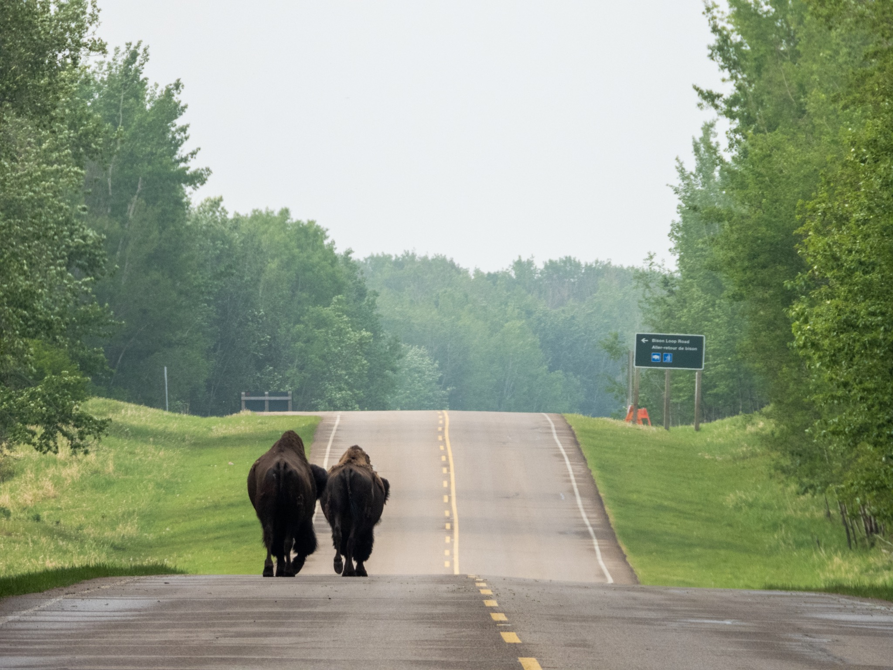

What is Project 366? Read more [here](https://thebirdsarecalling.com/2019/03/29/project-366/)!

Well, it had to happen..., my bison mojo is back. Just like last Sunday, today I was up at 5 am, on the road at 5:15 and at Elk Island by 6 am. I can get used to this Sunday morning routine. There were plenty of bison around this time. A number of Wood Bison were hanging out along the fence in the South part of the park and I probably must have seen a dozen or so Plains Bison throughout the morning in the North part of the park. Most of them were hanging out out by the aptly named Bison Loop, a few kilometres long gravel loop for for watching bison from your vehicle (but, ironically, I rarely finding bison at the Bison Loop). As I emerged from the Bison Loop I bumped into these two fellas that were taking a stroll down the main thoroughfare towards the Bison Loop (note road sign). Perhaps they just wanted to find out how it is to tour the Bison Loop from “the other side”. It was a bit hazy, probably due to lingering fire smoke, so taking photographs was a bit tricky, particularly when shooting over a long distance. One can see a bit of the haze in the picture. The morning turned out successful, however. I spend quite some time observing a very hungry Musk Rat that was going to town with the aquatic vegetables. A whole bunch of Northern Shovelers and Blue-winged Teal were in the ponds as well, both very beautiful waterfowl. I saw a sparrow that I am still working on identifying, so that one is still a loose end, but I did score two lifers, the Least Flycatcher (_[Empidonax minimus](https://ebird.org/species/leafly)_, Lifer #160, AB Big Year #111) and the Yellow Warbler (_[Setophaga petechia](https://ebird.org/species/yelwar)_, Lifer #161, AB Big Year #112).

_Nikon P1000, 605mm @ 35mm, 1/250s, f/5, ISO_ 160

_May the curiosity be with you. This is from “The Birds are Calling” blog ([www.thebirdsarecalling.com](http://www.thebirdsarecalling.com)). Copyright Mario Pineda._
