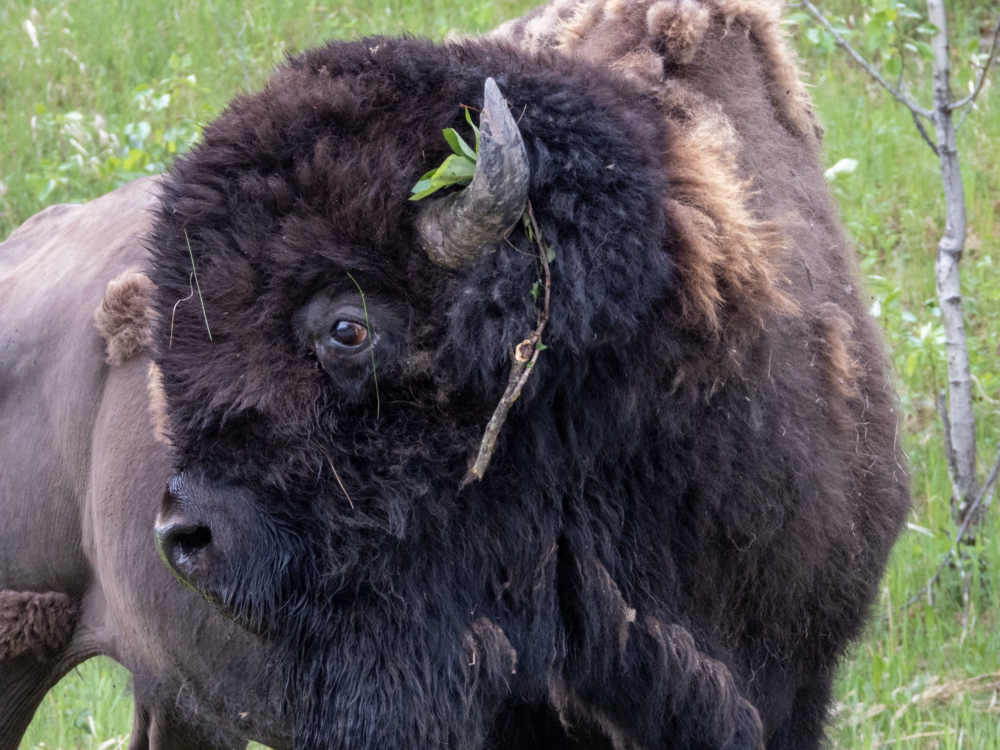

What is Project 366? Read more [here](https://thebirdsarecalling.com/2019/03/29/project-366/)!

Bison fur consists of a thin layer of short hair right agains the skin and an outer layer of coarse long hair. In the fall the bison grow the long outer fur to keep them nice and toasty throughout the winter. In the spring they shed their outer coat in large clumps making them look quite mangy. Right before I took this picture this male was wallowing, rolling around in the dry dirt, presumable to try to shed his winter coat. As he stood up a leafy twig got caught behind his horn. Bison wallow for many purposes, such as relieving skin irritations, shed their winter coat, seeking relief from biting insects, as a social behaviour or as part of their mating behaviour during the breeding season. There is an informative [writeup on wallowing in bison on the US National Parks web site](https://www.nps.gov/articles/bison-bellow-1-28-16.htm). It turns out that wallowing creates bowl-like depressions, wallows, that serve important ecological roles in the prairie ecosystem. More on that later, however, once I post a picture of a wallow. This bison was just a few meters away from me so, resisted the temptation to step outside the vehicle and shot this picture from the car. The bison at Elk Island are remarkable accepting of humans in vehicles. [Not so much with humans outside of vehicles](https://www.cbc.ca/news/canada/edmonton/bison-attack-elk-island-national-park-1.4678742).

Nikon P1000, 258mm @ 35mm, 1/60s, f/4.5, ISO 400

_May the curiosity be with you. This is from “The Birds are Calling” blog ([www.thebirdsarecalling.com](http://www.thebirdsarecalling.com)). Copyright Mario Pineda._
