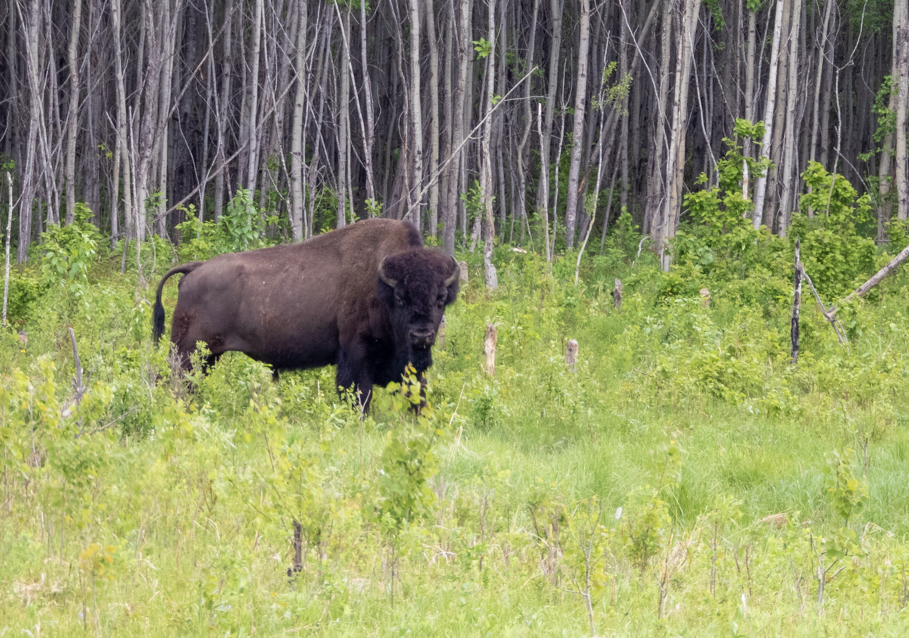

What is Project 366? Read more [here](https://thebirdsarecalling.com/2019/03/29/project-366/)!

This is the third day of bison-themed posts. Another post and another bison..., yet, this one is different. All my bison pictures and posts so far have featured Plains Bison (_Bison bison bison_). Today’s picture, however, is featuring a Wood Bison (_Bison bison athabascae_). Why the trinomial names, instead of the usual Linnaean binomial names? Well, Plains and Wood Bison are considered subspecies within the genus _Bison,_ just like you and I belong to the subspecies _Homo sapiens sapiens,_ which is different from the extinct subspecies _Homo sapiens neanderthalensis,_ both belonging to the genus _Homo._ Morphologically Wood and Plains Bison can be told apart by Wood Bison being substantially larger with bulls averaging 880 kg and females 540 kg while Plains Bison bulls average 739 kg and females 440 kg - so about a 100 kg difference, not exactly spare change. Wood Bison also have a pronounced hump above their shoulder blades forward of their front legs while the Plains Bison is lacking the hump and have their highest point along their back centered over their front legs. Although they are of different sizes and one has a hump, if you do not have them right next to each other telling them apart is probably as easy as telling a Downy Woodpecker from a Hairy Woodpecker (that was a birder joke). If you visit the bison at Elk Island telling them apart (the bison, not the woodpeckers) is child's play. If you see a bison north of the Yellowhead Highway it is a Plains Bison and if you see a bison south of the highway it is a Wood Bison. This fella was a southerner so, yeah..., definitely a Woody.

The park maintains about 450 Plains Bison and about 315 Wood Bison, selling off any surplus animals. Historically, the Plains Bison lived primarily in their Greater Plains of central North America, while the Wood Bison lived further north, from Alaska into Yukon and the North West Territories and in Northern British Columbia, Alberta and Saskatchewan. It is believed that there used to be up to 30 million Plains Bison and about 170000 Wood Bison during their heydays. All was hunky dory until the Europeans arrived. When the Europeans colonized North America the population numbers of both bison species declined rapidly. By the late 1800s, Plains Bison no longer existed in Canada and the Wood Bison population was down to about 200 individuals. Conservation efforts saved the bison from complete extinction with populations today around 375000 Plains Bison and 6000 Wood Bison.

Nikon P1000, 504mm @ 35mm, 1/250s, f/5, ISO 400

_May the curiosity be with you. This is from “The Birds are Calling” blog ([www.thebirdsarecalling.com](http://www.thebirdsarecalling.com)). Copyright Mario Pineda._
