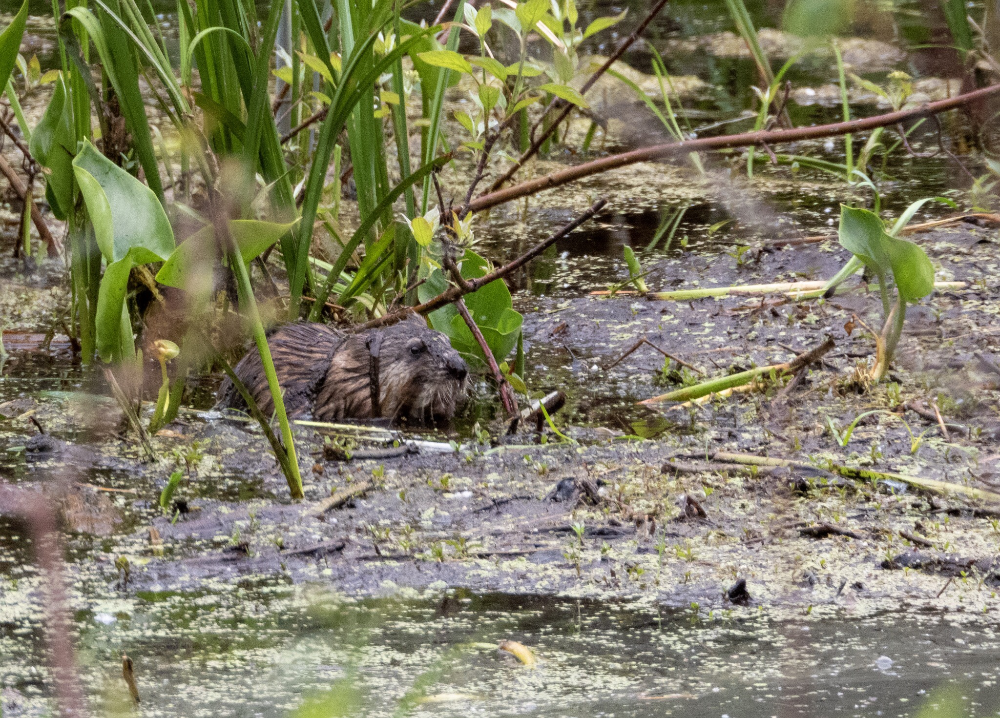

What is Project 366? Read more [here](https://thebirdsarecalling.com/2019/03/29/project-366/)!

Muskrats are medium-sized rodents, almost like a mini-beaver, but with a rat-like tail instead of the big paddle tail of the beaver. They are basically large field mice adapted to life in water. They have a groovy dental adaptation allowing them to chew with their mouths closed. Their front teeth protrude ahead of the checks and lips allowing them to chew food under water while their mouth technically remains closed. I found this fella in a shallow pond at Elk Island National Park sitting in waist-deep (by muskrat standards) water munching on his breakfast consisting of aquatic plants. He seemed quite hungry as he was really going to town with his veggies and did not seemed bother with my presence, even when I pulled out and assembled my large tripod. Below is a short video clip of his energetic chewing. The video almost looks like it has been sped up, but it’s a regular speed. Let’s call the muskrat Spikey after his spiky and funky hairdo. So, as I was saying, it is not the video that has been sped up, but rather, it is Spikey that is living his (her) life in the fast lane.

Nikon P1000, 756mm @ 35mm, 1/200s, f/5.6, ISO 400

https://youtu.be/I8DdgTifY7A

_May the curiosity be with you. This is from “The Birds are Calling” blog ([www.thebirdsarecalling.com](http://www.thebirdsarecalling.com)). Copyright Mario Pineda._
