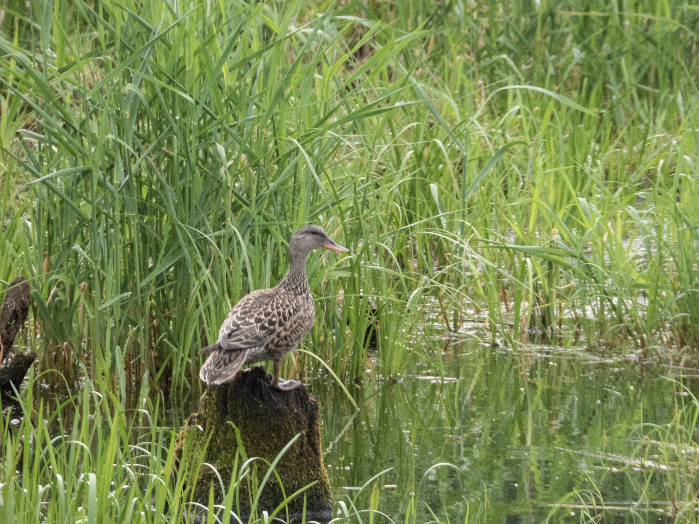

What is Project 366? Read more [here](https://thebirdsarecalling.com/2019/03/29/project-366/)!

Mallards are one of the most ubiquitous birds in the Northern hemisphere (+ Australia and New Zealand where they have been introduced) and are probably one of the first birds children learn to recognize, although they are more likely to refer to them as ducks, rather than mallard. Technically the name duck is the common name for a large number of species in the waterfowl family _Anatidae_ which includes swans and geese. During a recent morning field trip to Elk Island National Park I found this lone female mallard perching on a tree stump in a shallow pond. She was eyeing me cautiously and seemed quite vigilant yet reluctant to move from her perch. It is possible that she had a nest with either eggs of chicks hidden in the tall grass. It was an overcast day and smoke blown in from forest in northern Alberta lingered over the landscape. The subdued light conditions made it somewhat challenging to take pictures with the Nikon P1000. It all boiled down to balancing the trade off between shutter speed, aperture and ISO to match the subject and light conditions. I took this particular picture at 1008mm (35mm equivalent) at 1/125s shutter speed, f/5.6 aperture and at ISO 560 from the driver’s seat through the open window on the passenger side. Cars make great blinds for wildlife photography. I was only a few meters away from the female and she was clearly aware of my presence. She seemed to tolerate my presence, but I am sure she would take off if I would get out of the vehicle. The long focal length and high ISO (by P1000 standards) did not bode well for a good picture, but I was pleasantly surprised that it turned out quite nice given the constraints.

Nikon P1000, 1008mm @ 35mm, 1/125s, f/5.6, ISO 560

_May the curiosity be with you. This is from “The Birds are Calling” blog ([www.thebirdsarecalling.com](http://www.thebirdsarecalling.com)). Copyright Mario Pineda._
