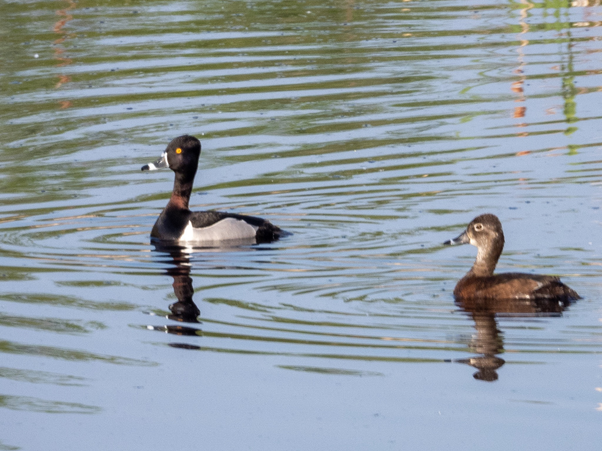

What is Project 366? Read more [here](https://thebirdsarecalling.com/2019/03/29/project-366/)!

Mingled in with the many Blue-winged Teals and Northern Shovelers there was this pair of unique looking ducks. Clearly a male and a female, I had to look it up in the Merlin App to positively identify these waterfowl. They were very “Scaup-like”, which obviously only makes sense to someone familiar with scaups (another waterfowl). The most obvious difference from a scaup, however, was a white band on the bills of both the male and female + the male had a white band at the base of the bill as well. They were very unique looking so identifying them was a cinch once I consulted Merlin. They are Ring-necked Ducks (Aythya collaris), a species of diving duck common in North America. Looking at reported sightings of Ring-necked Ducks in eBird reveals that while this is definitely a North American species, these ducks get around. There are many reports of vagrants found on tiny isolated islands in both the Atlantic and the Pacific oceans and beyond, such as in Japan and Western Europe. Further online research does provide a bit more context. These ducks are strong flyers and are know to have a tendency to stray far away from their normal range.

Nikon P1000, 1411mm @ 35mm, 1/500s, f/5.6, ISO 180

_May the curiosity be with you. This is from “The Birds are Calling” blog ([www.thebirdsarecalling.com](http://www.thebirdsarecalling.com)). Copyright Mario Pineda._
