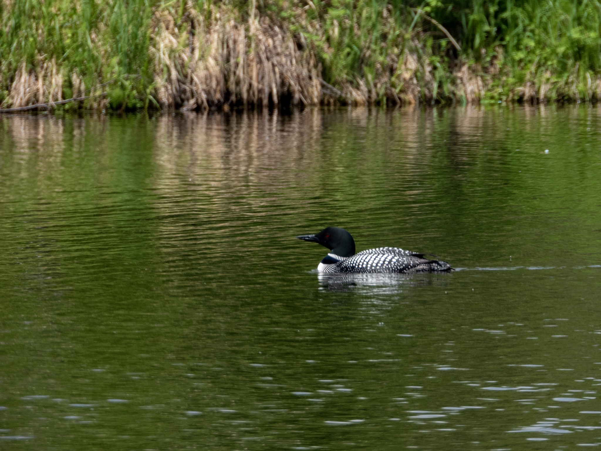

What is Project 366? Read more [here](https://thebirdsarecalling.com/2019/03/29/project-366/)!

A change of tunes as today’s picture comes from a fishing trip rather than a nature walk. I don’t do many fishing trips as I prefer to watch the animals and let them live to see another day. While I do have personal objections to hurting or killing animals, which is why stick to plant-based foods myself, I also accept and respect that others have different opinions. Here is the snag thought, if you are consuming animal-based foods, then you should also know where it is coming from and what it takes to acquire it and process it. Contrary to some people’s ideas, fish sticks do not grow on trees (there were stories when I went to elementary school many moons ago about the fish stick tree). So this is where the occasional fishing trip comes in. I see this as a learning opportunity for my meat eating son to catch, dispatch, process and cook his own fish. I am ok with him eating meat as long as he understand on a very personal level what it takes to get it to his dinner plate. You can read and watch YouTube videos about where animal-based foods come from until you are blue in your face, but nothing can replace the experience of fishing or hunting for your own food and then going through the entire process all to way to the plate. If you appreciate your fish or meat after experiencing this process first hand, then good on you. Alternatively, you might also start to question whether animal-based foods are right for you..., but that is a different story altogether. Enough of the philosophical discourse.

Today’s fishing excursion took us to the Ashland Reservoir, about 1 hrs drive south west of Edmonton, close by the hamlet Of Warburg (which has an awesome [small burger joint](https://www.google.com/search?q=warburg+burgers&rlz=1C9BKJA_enCA803CA803&oq=warburg+burgers&aqs=chrome..69i57.4574j0j4&hl=en-US&sourceid=chrome-mobile&ie=UTF-8#lkt=LocalPoiReviews&trex=m_t:lcl_akp,rc_f:nav,rc_ludocids:17555650231269459836,rc_q:Warburg%2520Corner%2520Restaurant,ru_q:Warburg%2520Corner%2520Restaurant) if you are into that sort of food). While the boys were fishing (and yes they did catch some trout) I tried my luck with the wildlife watching. The lake is surrounded by lush deciduous forests and agricultural fields. The lake did not have much water fowl in it, and other than a solitary Common Loon, a few Great Blue Herons, the ever-present Mallard, Red-winged Blackbirds and Canada Geese there was not much else to report. My hunch is that the lack of reeds along the shoreline might be a possible reason for the low diversity. That did not stop the muskrats, however, to put on quite a show. They were quite charming as they were swimming to and fro and curiously checking out our fishing attempts. Long live the muskrats.

Nikon P1000, 868mm @ 35mm, 1/500s, f/5.6, ISO 110

_May the curiosity be with you. This is from “The Birds are Calling” blog ([www.thebirdsarecalling.com](http://www.thebirdsarecalling.com)). Copyright Mario Pineda._
