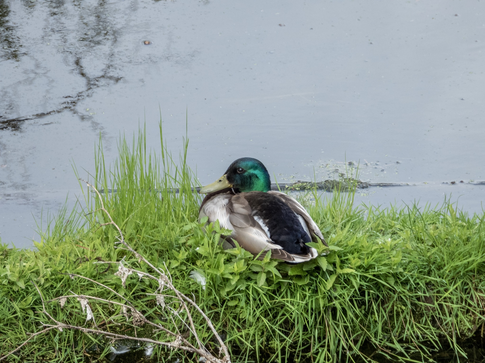

What is Project 366? Read more [here](https://thebirdsarecalling.com/2019/03/29/project-366/)!

The very first bird we spotted as we arrived at the oxbow pond down at the Whitemud ravine was a male mallard that was snoozing on a log. The log was covered in lush greenery with the mallard cosy like a bug in a rug in the greenery. It was very idyllic and looked quite comfortable. Oxbow ponds are unique habitats where the water is still and stagnant compared to the rushing water in the creek. There are rumours of numerous oxbow ponds along the Whitemud creek. So far I have found two, both almost entirely covered with thick riparian vegetation making them surprisingly difficult to spot although they are only steps away from the trail. This particular oxbow is the largest one I have found so far and is bound by an old beaver dam at the north end and a wall of accreted sediments on the south end. Groundwater and seepage from the west side of the ravine feeds the oxbow, as does spring and surface runoff. Other than seasonal fluctuations in the water level the water is completely still in these pond.

Nikon P1000, 604mm @ 35mm, 1/250s, f/5.0, ISO 180

_May the curiosity be with you. This is from “The Birds are Calling” blog ([www.thebirdsarecalling.com](http://www.thebirdsarecalling.com)). Copyright Mario Pineda._
