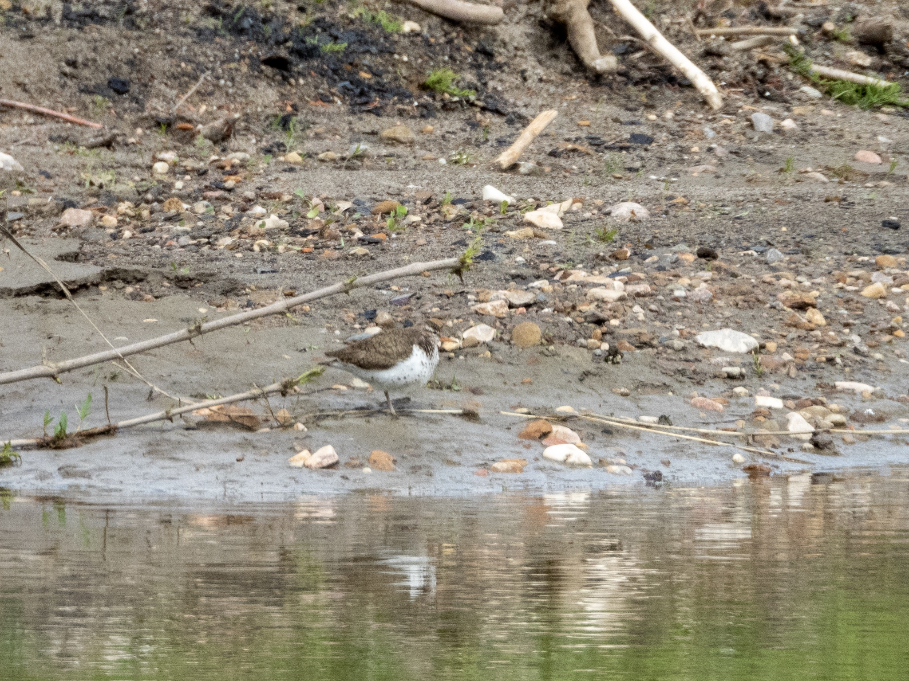

What is Project 366? Read more [here](https://thebirdsarecalling.com/2019/03/29/project-366/)!

Something was definitely moving along the water’s edge, we just could not immediately focus in on it. It took us a while to adjust our eyes and calibrate our brain to pick up the small stealthy bird scurrying around on the sandy shore on the opposite side of the creek. It was a small shorebird with spotted underparts and sand brown upper parts. If it would not move around it would be nearly impossible to see against the sand and pebbles along the shoreline. I have not seen many shorebirds in my life and this one was definitely a new one. While it was working the shoreline for a morsel to eat its tail was continuously bobbing up and down. Ultimately, this is what gave it away..., it was a Spotted Sandpiper ([Actitis macularius](https://ebird.org/species/sposan), Lifer #162, AB Big Year #114). The Spotted Sandpiper is a true American as it can be found from the Canadian high arctic during the boreal summer down to the shorelines of Chile during the austral summer.

Nikon P1000, 868mm @ 35mm, 1/500s, f/5.6, ISO 280

_May the curiosity be with you. This is from “The Birds are Calling” blog ([www.thebirdsarecalling.com](http://www.thebirdsarecalling.com)). Copyright Mario Pineda._
