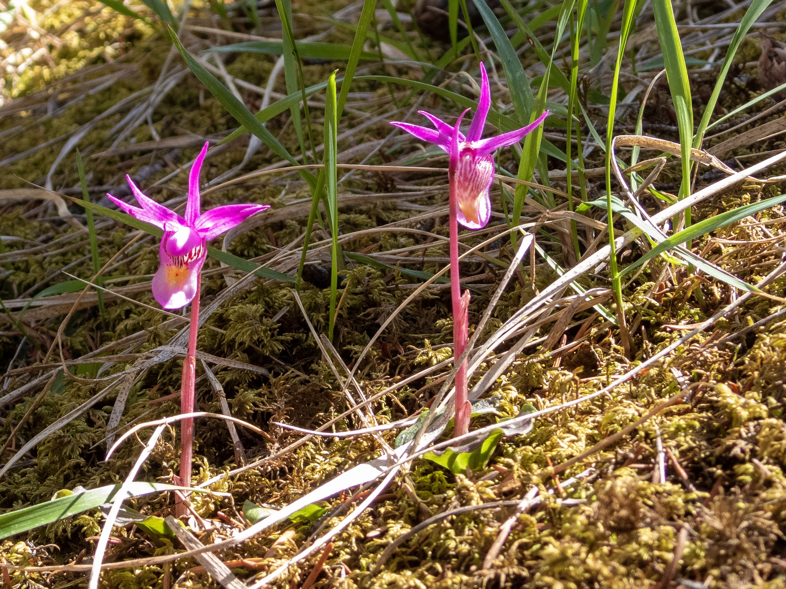

What is Project 366? Read more [here](https://thebirdsarecalling.com/2019/03/29/project-366/)!

Along a forested section of the trail looping around the First Lake on the Valley of the Five Lakes trail we encountered these small purple flowers poking through the thick moss cover. They had an “orchidy” sort of look to them but at the time I did not know what they were. It turns out they they are indeed orchids known by various names, including, Calypso Orchid, Venus’ Slipper or Fairy Slipper (_Calypso bulbosa_ var. _americana_). It is a circumpolar perennial orchid found in undisturbed montane forests. They belong to the genus Calypso, which only contains this one species, which takes its name from Greek signifying concealment, as they tend to favour sheltered and undisturbed areas of conifer forest floors. Although it is wide spread globally it is considered threatened or endangered in some part of the world (e.g. several U.S. states and in Sweden and Finland) as it is sensitive to disturbances and has a rather finicky reproductive strategy. It relies on visits by pollinating insects, specifically bumblebees here in Alberta, by deception as it does not produce any nectar to reward its pollinators. As a result insects quickly learn not to visit it again. Talk about burning your bridges reproductively.

_Nikon P1000, 6_2_mm @ 35mm, 1/125s, f/4, ISO 100_

_May the curiosity be with you. This is from “The Birds are Calling” blog ([www.thebirdsarecalling.com](http://www.thebirdsarecalling.com)). Copyright Mario Pineda._
