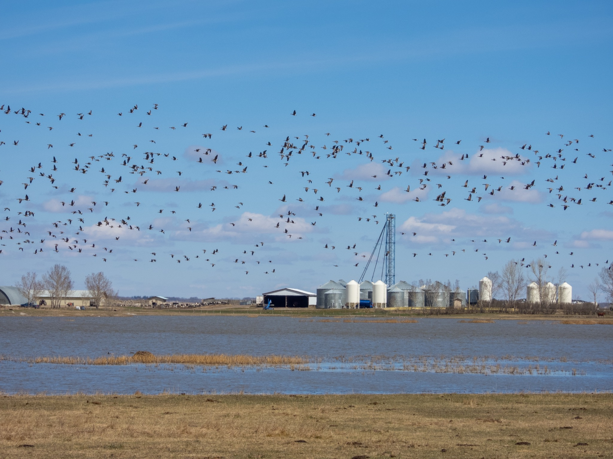
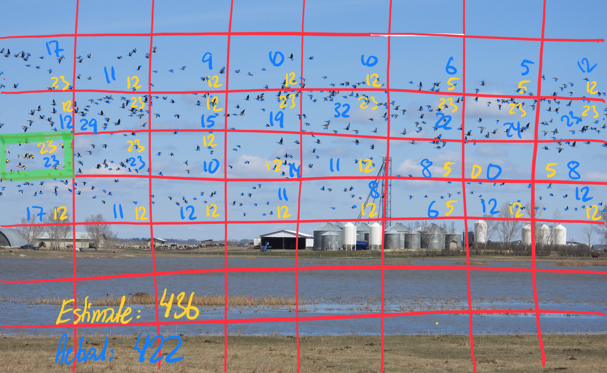

What is Project 366? Read more [here](https://thebirdsarecalling.com/2019/03/29/project-366/)!

The first time I ran into the conundrum of how to quantify the number of individuals in a large flock of birds was as at the edge of the Pacific Ocean at Boca Budi in southern Chile. On the cliff face overlooking the Pacific Ocean we encountered a colony of nesting Red-legged Cormorants (_[Phalacrocorax gaimardi](https://ebird.org/species/relcor1)_). Our best estimated was that the visible portion of their cliff had a minimum of 300 individuals, a number that was likely an underestimate. [Here is a link to the eBird checklist](https://ebird.org/view/checklist/S50993192). The second time I ran into the same problem, albeit on a different magnitude, was at a small pond outside of Tofield (Alberta) full of snow geese (_[Anser caerulescens](https://ebird.org/species/snogoo)_). Our best estimate was that there were 15000 geese on the water and in their air. [Here is a link to the eBird checklist](https://ebird.org/view/checklist/S54923678). Both times we had no particular estimation strategy, but rather we based our estimates on eyeballing and whatever “common sense” we had (whatever that means in this context). A few weeks ago we encountered a large flock of Canada Geese taking off from a farmer’s field outside of Camrose, this time I decided to go about the estimation more systematically by using one of the photos I took of the fleeing geese.

Nikon P1000, 123mm @ 35mm, 1/1600s, f/4, ISO 100

Once I had the photo on my computer screen I proceeded by according to the following steps:

1. I started by dividing up the image into a grid (see image below).
2. I counted each bird in the grid cell with a green outline. There were 23 individuals in this cell.
3. I used the patter from this cell to estimate the number of individuals in every other cell. The estimates are in yellow and fall into four categories, “looks like 23”, “looks like half of 23, i.e. 12”, “looks less than half, i.e. 5” or “no birds = 0”.
4. I added up the estimates (the yellow numbers) and got an estimate of 436 geese.
5. To check how good my estimated was I then counted the actual number of individuals in each grid cell (note the blue dots), indicated in blue numbers, and added it up. There are exactly 422 geese in the picture.

The estimate is not to shabby but obviously begs the question how one would (could) modify this approach to do “live” estimates in the field. I guess doing a “posts-observation” estimate like this is also fine to as long as all the birds are in the picture to start with.

The main issue with this estimate is that the image does not include all the geese. There were plenty more geese both to the right and left of the picture. This estimate was more a proof of concept exercise that still needs to be refined to be useful in the field when you have a gaggle of geese flying by in a matter of seconds.

_May the curiosity be with you. This is from “The Birds are Calling” blog ([www.thebirdsarecalling.com](http://www.thebirdsarecalling.com)). Copyright Mario Pineda._
