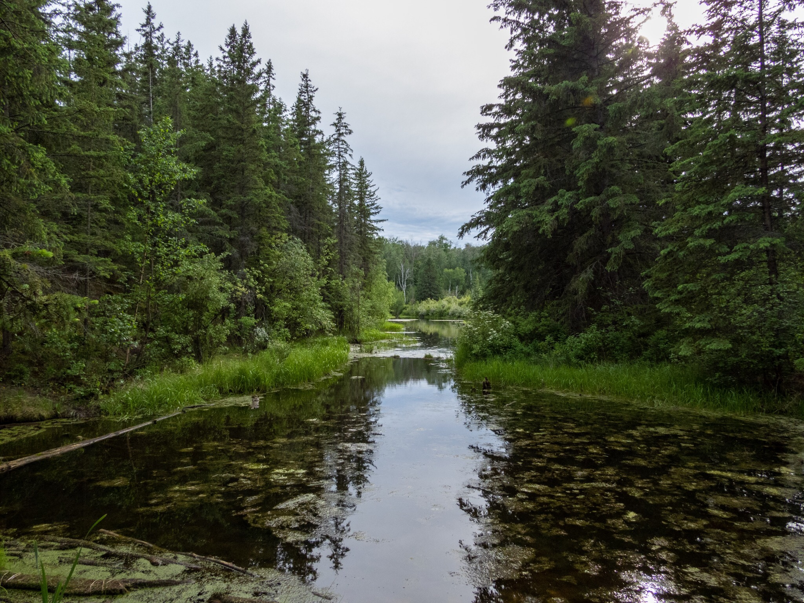

What is Project 366? Read more [here](https://thebirdsarecalling.com/2019/03/29/project-366/)!

Yesterday I went for a nature walk to a part of the Whitemud Creek that is located south of the 23rd Avenue. I have not been to this location previously and I just happened to run some errands in this neighbourhood so I decided to “kill two birds with one stone” and squeeze in a short nature walk in-between errands. As it turns out this part of the creek flows through the Mactaggard Sanctuary, a 104 hectares nature sanctuary, part of which was donated to the University of Alberta in 1980 by [Sandy A. Mactaggard](https://en.m.wikipedia.org/wiki/Sandy_Mactaggart), a developer and philanthropist. The sanctuary has a interesting history, which also explains why it is called a “sanctuary” and not a “park”. There is [a video where the late Mr. Mactaggard tells the story behind the sanctuary](http://www.lieutenantgovernor.ab.ca/AOE_Legacy/Member/69/ShowVideo?modelId=69&videoId=1539). In short, the sanctuary used to be located outside of Edmonton when Sandy Mactaggard originally purchased the land for housing development, but only after promising the previous owner of the land that he will preserve it to benefit the citizens of Edmonton. The purpose was not to turn it into another park, but rather keep it pristine and let it remain the way it always had been. That is why it became a sanctuary. The trails along this part of the creek are more untamed and rough with less traffic.

I did not have much time for my nature walk so I had to move quick and as a result did not get much birding done. My main aim was to find a large oxbow lake situated in the sanctuary and do some preliminary scouting to figure out how to access the lake. Oxbow lakes are often enveloped in dense vegetation and can be difficult to find and access. The benefit of this is that many animals use these lakes for raising their young. I did not have any trouble finding the lake as the trail briefly passes right along side of it, but just as I suspected most of the lake is surrounded by dense vegetation. Accessing the more remote parts of the lake (the ones where the trail did not go) proved, however, to be even more difficult than I had anticipated as the entire outside rim of the lake is surrounded by a high and very steep bank (almost like an overgrown cliff) and there was not obvious way of accessing the shoreline. There is a trail, the Mactaggard sanctuary loop trail, that loops around the lake ascending the steep bank. Although this quick exploration gave me some ideas of how one might be able to access some of the more remote parts of the lake, I did not have time to look into the feasibility of any of these possibilites. That will have to be another excursion. On a different note, the mosquitos were voracious and I did not bring any repellent so, this is a reminder to myself not to forget the repellent next time.

Oxbow lake in Mactaggard Sanctuary along Whitemud Creek, Edmonton. June 13, 2019. Nikon P1000, 24mm @ 35mm, 1/800s, f/2.8, ISO 100

_May the curiosity be with you. This is from “The Birds are Calling” blog ([www.thebirdsarecalling.com](http://www.thebirdsarecalling.com)). Copyright Mario Pineda._
