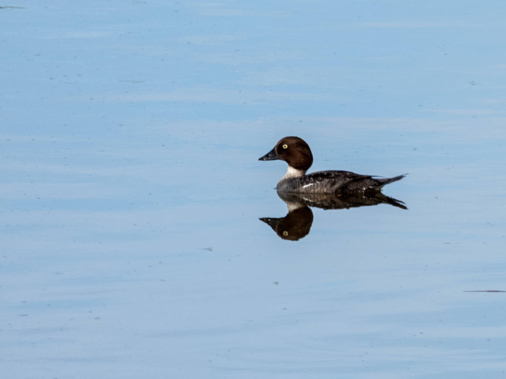

What is Project 366? Read more [here](https://thebirdsarecalling.com/2019/03/29/project-366/)!

As I crossed the pedestrian bridge across the Whitemud Creek a lone female Common Goldeneye ([Bucephalus clangula](https://ebird.org/species/comgol)) was swimming around in the creek eyeing me curiously. Common Goldeneyes are medium-sized diving ducks where the females are brunettes with a piercing golden-yellow eye. There are two species of goldeneyes, the Common Goldeneye, which as the name suggests is more common, and, the more rare, Barrow’s Goldeneye. While the males of the two species are easy to tell apart, the females are more difficult to distinguish as they appear nearly identical. According to Sibley the Barrow’s Goldeneye female has a darker brown head than the Common Goldeneye which does not help me at all since I did not have the two species next to each other for comparison. Perhaps the best distinguishing characteristic between the females of the two species for someone like me that has only seen a handful of these species is the bill color. According to Sibley the female Barrow’s Goldeneye has a “usually mostly yellow” bill while the female of the Common Goldeneye has a “usually mostly black” bill. Looking at the picture I would say that her bill is definitely in the category “mostly black”; ergo, it is a Common Goldeneye.

Female _Common Goldeneye (Bucephala clangula) at Whitemud Creek (Alberta, Canada) on June 14, 2019. Nikon P1000, 1109mm @ 35mm, 1/125s, f/8, ISO 100_

_May the curiosity be with you. This is from “The Birds are Calling” blog ([www.thebirdsarecalling.com](http://www.thebirdsarecalling.com)). Copyright Mario Pineda._
