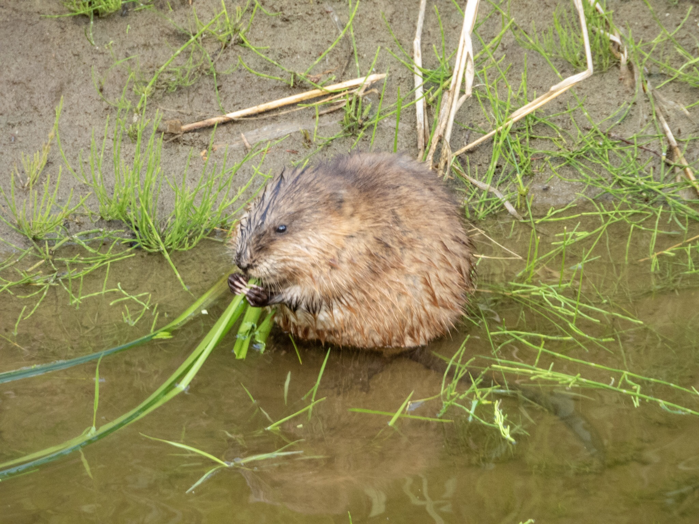

What is Project 366? Read more [here](https://thebirdsarecalling.com/2019/03/29/project-366/)!

Another nature walk and another muskrat sitting in the bath going to town with its vegetables. It seems that every time I come across muskrats they seem to be eating. Maybe they are just more conspicuous when they are eating..., or maybe they are just always eating, just like human teenagers. I imagine one would have to chomp down quite a bit of vegetables to get your daily nutrient requirements. Just like me, muskrats are facultative herbivores which means that they prefer to eat plants but, if necessary, can also consume animal such as fish, frogs and insects. The other day as I was out by a lake with some young ones we spotted a muskrat swimming around and, too my surprise, not eating (but it was probably looking for food). When the kids saw it they immediately identified it as a beaver. To be entirely honest, the first time I saw a muskrat I also mistook it for a beaver. The muskrat is like the lesser known cousin of the superstar beaver in that everyone recognizes a beaver (even if they have never seen one) while few people recognizes the muskrat (even if you might be looking at one). Perhaps the easiest way to tell these semi-aquatic rodents apart, particularly if it is your first time seeing one, is the tail. Beaver with its tell-tale flat and paddle-shaped tail while the muskrat has a long, skinny tail with flat sides. If you can see the tail there really is no way of mis-identifying a muskrat for a beaver. In the picture below you can clearly see the long skinny tail of the muskrat. Once you become a more seasoned muskrat aficionado you realize that there are a few other distinguishing characteristics as well. Perhaps the most obvious difference (if you know about it) is the size difference. Beavers are huge weighing in at between 35 and 60 pounds while muskrats are puny in comparison topping out at about 4 pounds. Another difference is that with muskrats you can usually see its whole body when it is swimming while with beavers you typically only see their large wedge-shaped head. While I have not seen a beaver at the creek for a while the musk rats are out in full force.

Muskrat (Ondatra zibethicus) at Whitemud Creek (Alberta, Canada) on June 14, 2019. Nikon P1000, 1210mm @ 35mm, 1/160s, f/5.6, ISO 400

_May the curiosity be with you. This is from “The Birds are Calling” blog ([www.thebirdsarecalling.com](http://www.thebirdsarecalling.com)). Copyright Mario Pineda._
