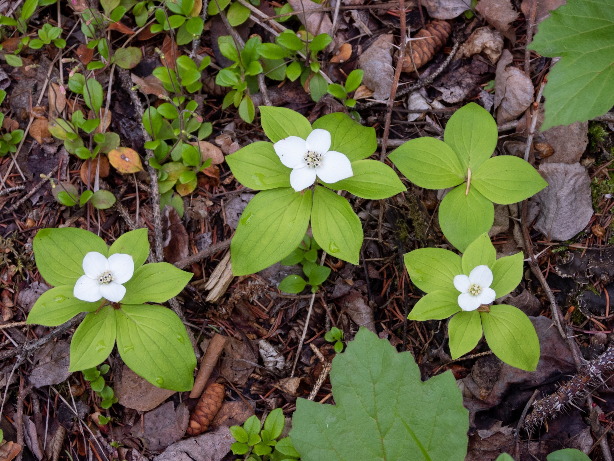

What is Project 366? Read more [here](https://thebirdsarecalling.com/2019/03/29/project-366/)!

I have been seeing these white flowers on the first floor all over the place. To continue in a state of ignorance is obviously unacceptable when it comes to something you encounter in every forest you visit. Sure enough, they were not difficult to identify. These are Bunchberries (Cronus canadienses), also known as Bunchberry Dogwood, a common plant carpeting moist forest floors throughout Canada. This unassuming plant has been referred to as the fastest moving plant in the world due to the curious way in which the plant spreads its pollen. The stamens in the Bunchberry are like miniature medieval trebuchets and, when triggered by an insect, launch the pollen into the air to coat the unsuspecting insect. If I would have known about this I would have definitely tried it out by poking at the flower. This is just a botanical ballistic experiment that I have to do next time I come across these plants. The original study reporting this remarkable pollen spreading strategy was published in the journal Nature in 2005. [Here is a link to the paper](https://www.nature.com/articles/435164a), but you need a subscription to access the article. There is, however, a [freely available PDF here](https://www.researchgate.net/profile/Dwight_Whitaker/publication/7852390_A_record-breaking_pollen_catapult_Nature_435164/links/5564b09d08aec4b0f4858fff/A-record-breaking-pollen-catapult-Nature-435164.pdf?origin=publication_detail) and there is also lots of information, including videos of the process, on the [website of the author](https://web.williams.edu/Biology/explodingflower/contact.html).

Bunchberry (Cornus canadienses) at Elk Island National Park (Alberta, Canada) on June 13, 2019. Nikon P1000, 134mm @ 35mm, 1/60 s, f/4, ISO 110

_May the curiosity be with you. This is from “The Birds are Calling” blog ([www.thebirdsarecalling.com](http://www.thebirdsarecalling.com)). Copyright Mario Pineda._
