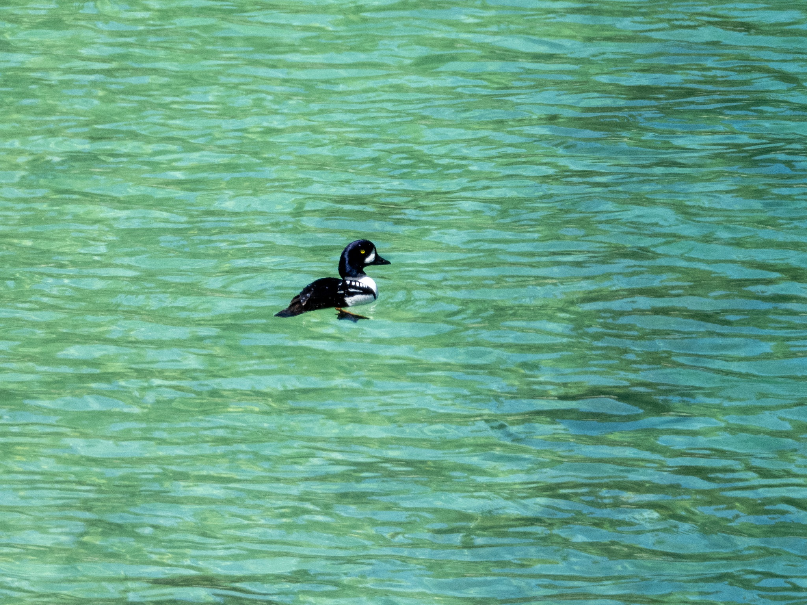

What is Project 366? Read more [here](https://thebirdsarecalling.com/2019/03/29/project-366/)!

A few days ago I wrote a post about a Common Goldeneye female soloing it in Whitemud Creek ([see post #079](https://thebirdsarecalling.com/2019/06/15/project-366-post-no-079-common-goldeneye/)). Well, as I mentioned in that post, there are two species of goldeneyes in these neck of the woods, the Common Goldeneye (_[Bucephala clangula](https://ebird.org/species/comgol)_) and Barrow’s Goldeneye (_[Bucephala islandica](https://ebird.org/species/bargol)_). Similarly to the Common Goldeneye, the Barrow’s Goldeneye is named after its piercing golden eye. While the species look very similar their distributions are quite different. The Common Goldeneye can be found across Canada, from the Pacific all the way to the Atlantic Ocean while Barrow’s Goldeneye, on the other hand, is found in a narrow belt running north south along the Rocky Mountains and the odd small pocket in Eastern Canada.

_Barrow’s Goldeneye (__Bucephala islandica__) at Valley of the Five Lakes in Jasper National Park (Alberta, Canada) on May 19, 2019. Nikon P1000, 655mm @ 35mm, 1/500 s, f/5, ISO 100_

_May the curiosity be with you. This is from “The Birds are Calling” blog ([www.thebirdsarecalling.com](http://www.thebirdsarecalling.com)). Copyright Mario Pineda._
