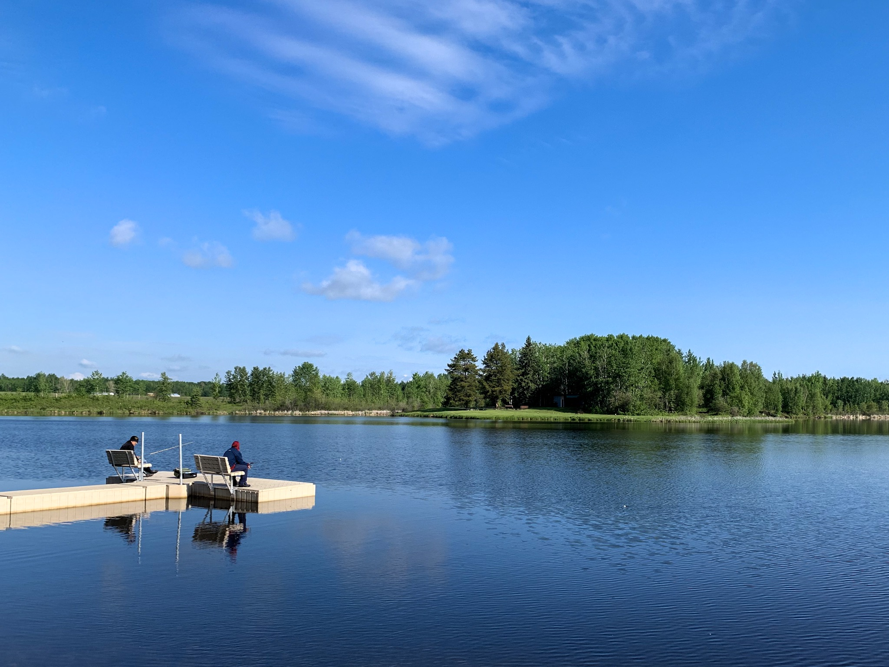

What is Project 366? Read more [here](https://thebirdsarecalling.com/2019/03/29/project-366/)!

There is mounting evidence that too much screen time is detrimental to humans, and in particular to children. Excessive screen time has physical effects of being sedentary and sitting for too long, as well as mental health issues and interrupted sleep patterns. The good news is is that the solution to the problem is right outside the door. Studies have shown that spending time outside and, in particular, in nature is highly beneficial to children’s’ (and adults’) physical and mental health. It reduces stress, anxiety, improves resiliency and improves sleep quality. I believe the best way of breaking the cycle of screen dependence in children and youth is to take them along into nature, essentially modelling the behaviour. You can go for a walk, you can birds watch or you can go fishing. A few weeks ago I took my teen and a borrowed one fishing at the Ashland Reservoir. They had a blast, caught a trout and even dispatched it and processed it themselves. In my day job I spend my time with 100+ teens and from getting to know them I know that most youth today have virtually no exposure to the natural world, never mind spending a few tranquile hours fishing for your lunch and then prepping it. These are skills and experiences that will last last a life time and provide much more meaningful memories than any screen can ever provide. Vive la nature!

_May the curiosity be with you. This is from “The Birds are Calling” blog ([www.thebirdsarecalling.com](http://www.thebirdsarecalling.com)). Copyright Mario Pineda._
