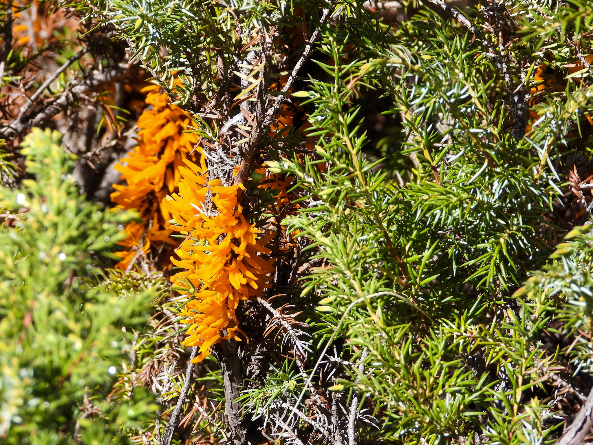

What is Project 366? Read more [here](https://thebirdsarecalling.com/2019/03/29/project-366/)!

During the last visit to Jasper National Park we came across this low coniferous shrub covered in odd looking orange spiky clusters. My suspicion is that it is some form of rusty fungus, but this comes from someone that knows absolutely nothing about fungi, so take that with a very large pinch of salt. Rusty fungi are pathogens that infect plants, and while they typically do not kill the plant they are considered unsightly when occurring in gardens. There are some 7000 species of rust fungi so trying to identify the species is no small feat. The second thought that came to my mind when I encountered the fungus (the first thought was, ”what on earth is that?”) was “how does it feel?”. Although spiky I had a sneaky suspicion that it might not be solid upon touch. I tried touching it and sure enough, as soon as the spikes were touched they collapsed into a slimy mess. The third though that came to my mind was “I wonder how it tastes?”, so without further ado I..., just kidding. I did resist the temptation to lick the slime off my fingers.

_Rusty fungus at Valley of the Five Lakes in Jasper National Park (Alberta, Canada) on May 19, 2019. Nikon P1000, 302mm @ 35mm, 1/400 s, f/4.5, ISO 100_

_May the curiosity be with you. This is from “The Birds are Calling” blog ([www.thebirdsarecalling.com](http://www.thebirdsarecalling.com)). Copyright Mario Pineda._
