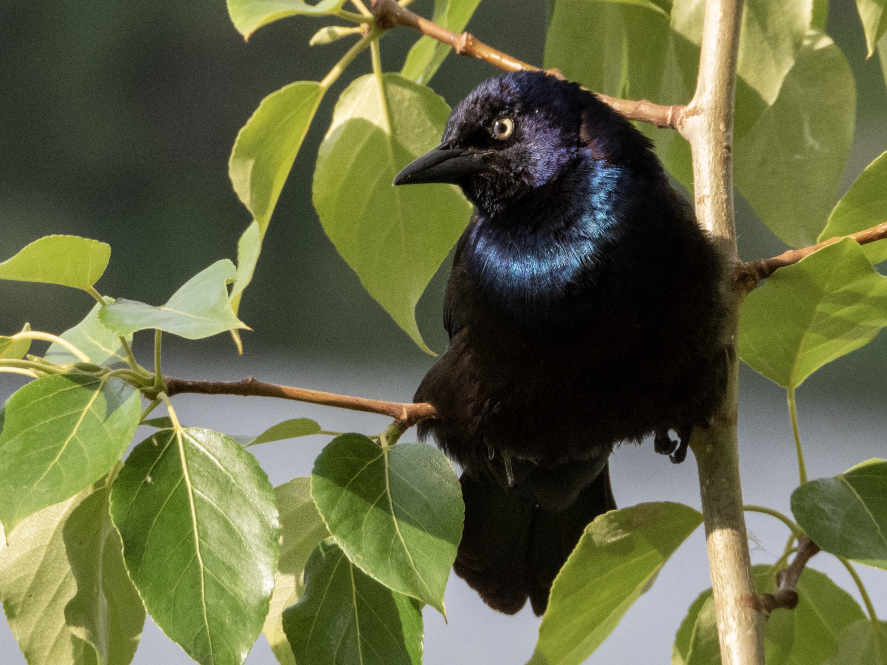

What is Project 366? Read more [here](https://thebirdsarecalling.com/2019/03/29/project-366/)!

It was an overcast Friday morning. It had been raining non-stop all week and the last time I was able to go for birding was a week ago. Luck was, however, on my side this morning. As I was heading out to work there was a break in the rain and next thing I knew the morning meeting I was heading to was rescheduled. All of a sudden I had one hour of rain-free unscheduled time at my disposal. Without further ado I ran back in, grabbed my camera binoculars and set my heading dead north. I was heading to Beaumaris Lake, a birding location I have heard lots of excited birders rave about but not had an opportunity to visit yet. Beaumaris Lake is a 2.7 km loop around a lake that is situated in the neighbourhood of, you guessed it, Beaumaris in North Edmonton. Despite its location in the midst of the subdivision, surrounded by houses on all sides, the lake is a birding hotspot with [158 species recorded on eBird](https://ebird.org/canada/hotspot/L795636). I spend the next 45 minutes strolling around the lake (I did not make it all the way around, so I have a good reasons to come back to explore the rest of the lake). The Red-necked Grebes were out in full force with their chicks hanging out with mom while dad was busy catching fish. While the Red-necked Grebe family were the highlight of the day, I also got a nice close up look at a bunch of Common Grackles. While it was overcast and grey when I arrived, once I started photographing the birds a well-timed break in the cloud cover let the sun through. The Common Grackles suddenly went from looking black to stunning dark blue purple iridescent. My time was soon up and I had to head to work. It was a wonderful start to the day and I will definitely be back to spend some more quality time at the lake getting to know its feathery inhabitants.

_Common Grackle at Beaumaris Lake (Alberta, Canada) on June 21, 2019. Nikon P1000, 756mm @ 35mm, 1/500 s, f/5.6, ISO 280_

_May the curiosity be with you. This is from “The Birds are Calling” blog ([www.thebirdsarecalling.com](http://www.thebirdsarecalling.com)). Copyright Mario Pineda._
