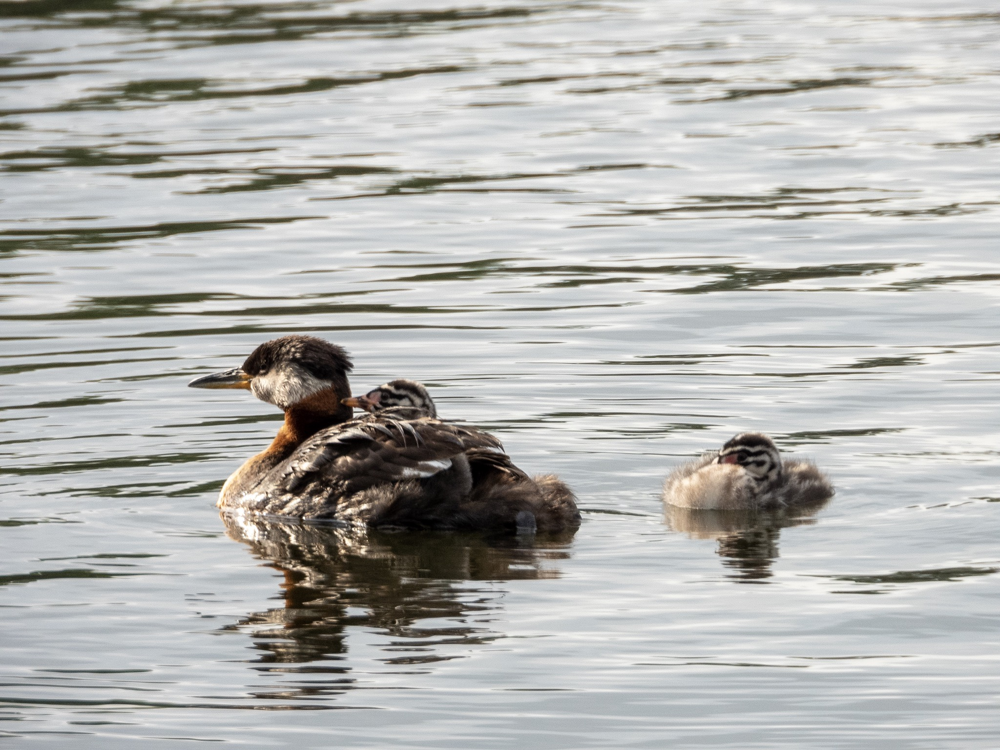

What is Project 366? Read more [here](https://thebirdsarecalling.com/2019/03/29/project-366/)!

It was a typical family scene that probably happens in bird families around the world every morning. While mom was looking after the kids, dad was busy looking for breakfast. The Red-necked Grebe family had two chicks, one of which was snoozing snug and cosy on mom’s back while the other one was floating nearby, also snoozing. Dad was nowhere to be seen. After about five minutes dad appears out of nowhere with a small fish in his beak. When realizing breakfast was incoming the chick floating on the water stirred, shook the sleep out of its eyes and raced towards the dad. The chick was rewarded with the fish. Dad took off right away and the chick swam back to mom and fell asleep again. This scene repeated itself several times over the next ten to fifteen minutes. The fish catching abilities of the dad were quite impressive. He returned with a new fish every few minutes. Most of the time the fish was small enough for the chick to eat it, but a few times he came back with impressively large fish that even he had trouble swallowing. He ended up having to let go of some of the fish as they were simply to large.

Red-necked Grebe (Podiceps grisegena) at Beaumaris Lake (Alberta, Canada) on June 21, 2019. Nikon P1000, 1008mm @ 35mm, 1/500s, f/5.6, ISO 125

_May the curiosity be with you. This is from “The Birds are Calling” blog ([www.thebirdsarecalling.com](http://www.thebirdsarecalling.com)). Copyright Mario Pineda._
