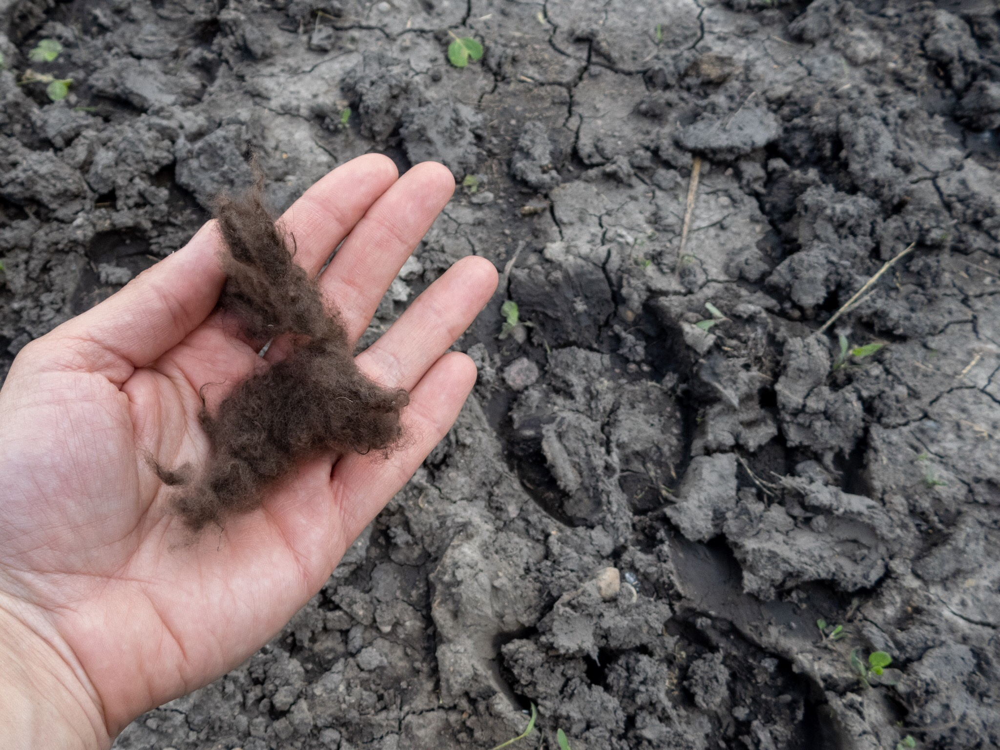

What is Project 366? Read more [here](https://thebirdsarecalling.com/2019/03/29/project-366/)!

In the center of the Bison Loop at Elk Island National Park there is a small shallow pond. You can clearly see it from the gravel road as it is no more than 25 meters away. Despite the proximity I have never actually been down to the water’s edge. I decided to change that unacceptable omission today..., I mean, I have been to the Bison Loop more times than I can count and never though it was worth going down to the water. I assume I though that looking down at the pond from the gravel road is close enough to see everything that could possibly be of interest around the pond. That is clearly the view of someone that still has a very superficial understanding of nature, someone that still does not know how to pay attention to the small details. Said and done. I found a well-beaten bison path through the tall grass (ticks anyone?) and walked down to the pond. It took me almost 30 seconds to get from the gravel road and down to the pond, so not to strenuous by any measure. The bison clearly used this pond as a watering hole as the surrounding grassy field was criss crossed by bison trails and the mud along the water’s edge was covered in bison hoof prints. In a low shrub along the trail a piece of bison fur was floating in the wind. I could not resist picking up the fur. I was half expecting the fur to be coarse and stiff and, perhaps, have some sort of bison body odour to it. To my surprise it was silky soft and had no smell at all.

Fur and tracks left by bison at Bison Loop pond. June 23, 2019. Nikon P1000, 24mm @ 35mm, 1/320s, f/2.8, ISO 100

_May the curiosity be with you. This is from “The Birds are Calling” blog ([www.thebirdsarecalling.com](http://www.thebirdsarecalling.com)). Copyright Mario Pineda._
