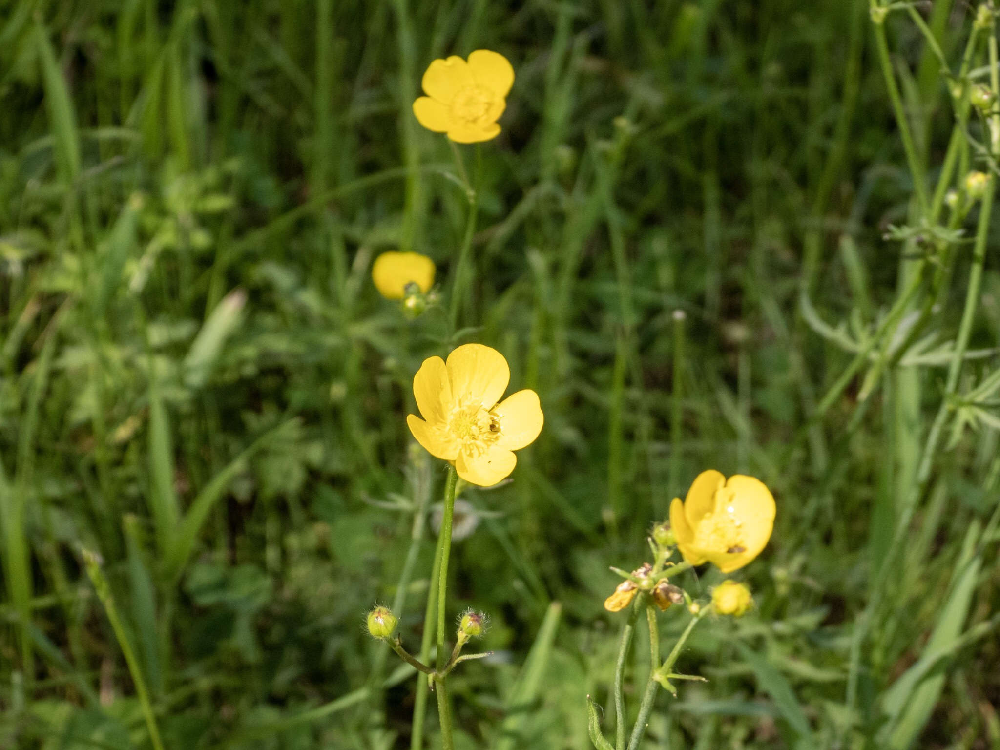

What is Project 366? Read more [here](https://thebirdsarecalling.com/2019/03/29/project-366/)!

The field surrounding the shallow pond was covered in tall grass with patches of tall stemmed yellow flowers. These were Meadow Buttercups (_Ranunculus acris_) at home in their perfect habitat, a moist meadow close to water. As pretty as it is, this is not a plant that is native to these neck of the woods. The plants native habitat is in Eurasia but these days the plant can be found across much of the world. It is considered an invasive weed and has developed resistance to herbicides. Even though it is an introduced species at Elk Island National Park, where I found these specimens, it makes a colorful addition to any wildflower meadow. These plants are perennials and are usually left alone by cattle as they are poisonous. The Alberta Agriculture and Forestry Department does not tiptoe around [what consumption of fresh Meadow Buttercup will do to animals](http://www.agric.gov.ab.ca/app107/loadPest?action=display&id=1) (which presumably would also include humans):

> When the fresh plant is ingested, enzymes break down the sap within the stems and leaves into a compound called protoanemonin that can cause irritation or blistering of the skin, mouth and digestive tract of the animal.  In severe cases, it can cause paralysis, convulsions and death. 

In other words kids, do not even think about eating this pretty plant. According to the Alberta Agriculture and Forestry Department this plant is relatively rare in the Elk Island region (Lamont County).

Meadow Buttercup at Bison Loop pond. June 23, 2019. Nikon P1000, 100mm @ 35mm, 1/1250s, f/3.5, ISO 100

_May the curiosity be with you. This is from “The Birds are Calling” blog ([www.thebirdsarecalling.com](http://www.thebirdsarecalling.com)). Copyright Mario Pineda._
