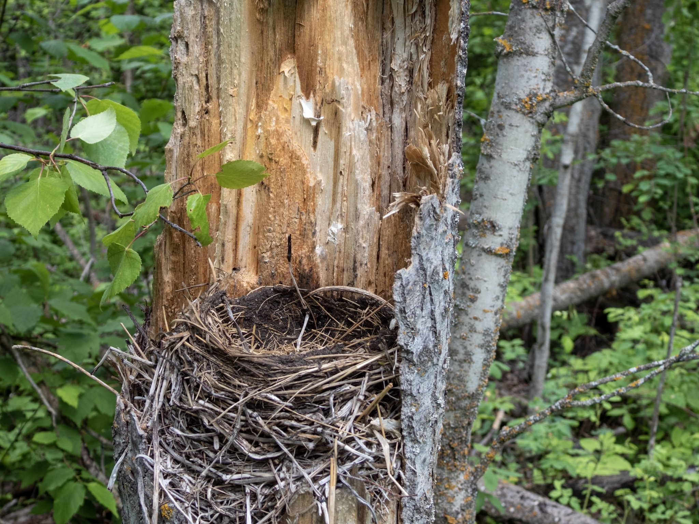

What is Project 366? Read more [here](https://thebirdsarecalling.com/2019/03/29/project-366/)!

Along Simmons trail in Elk Island National Park there is a 4 foot tall tree stump. It looks like the tree snapped like a match during a windstorm. The way the tree broke off left a piece of bark jutting up from the broken surface almost like a semicircular retaining wall. Inside the stump, sheltered by the protruding bark piece an American Robin has build a nest. I have seen the nest occupied on several occasions (for example [here](http://thebirdsarecalling.com/2019/05/28/project-366-post-no-061-nesting-robin/)), but last weekend the nest was empty and the robin was nowhere to be seen. There were no remnants or signs of chicks or eggs in the nest. Maybe the chicks, hatched and moved out? Apparently robin chicks are ready to move out of their parents’ digs after 2 weeks, which is quite amazing when you consider they are helpless and featherless when they hatch. As summer just arrived I am wondering if we might see the same or a different robin (or another bird) move in and raised a family before the season is over.

_Empty robin nest at Elk Island National Park. June 23, 2019. Nikon P1000, 62mm @ 35mm, 1/100s, f/3.5, ISO 100_

_May the curiosity be with you. This is from “The Birds are Calling” blog ([www.thebirdsarecalling.com](http://www.thebirdsarecalling.com)). Copyright Mario Pineda._
