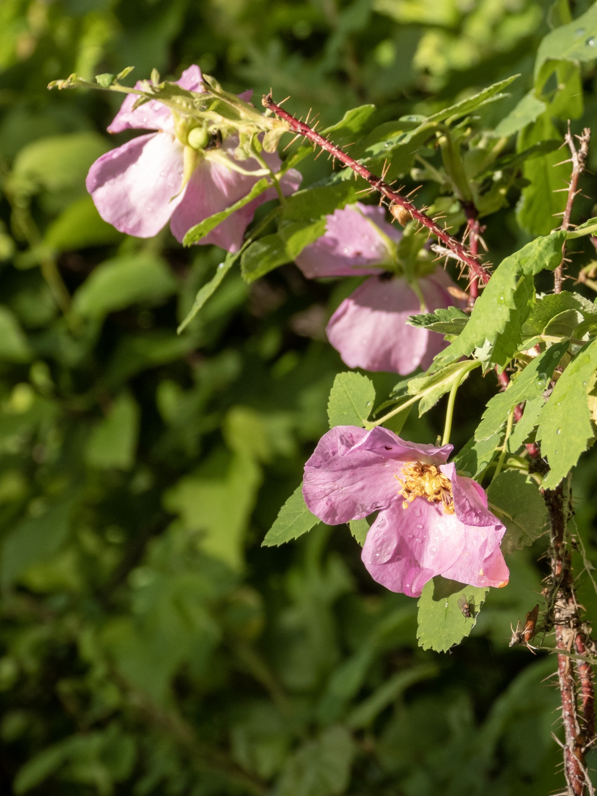

What is Project 366? Read more [here](https://thebirdsarecalling.com/2019/03/29/project-366/)!

The Prickly Wild Rose (_Rosa acicularis_), also known as Alberta Wild Rose, Wild Rose and Nootka Rose is a small deciduous shrub with pink flowers and thick, thorny stems. Once the flowers wither it turns into a small oval shaped seed pod known as a rose hip. It has a circumpolar distribution occurring on both sides of the Pacific and Atlantic oceans and is the official flower of the province of Alberta. Rose hip soup is a bit of a staple food stuff in Sweden. In this part of the world you would be lucky if you found rose hip tea. There is however a little know but reliable supplier of a “Rosehip drink” in these neck of the woods. At IKEA they stock rosehip drink, which is probably as close as you get to bonafide Swedish rosehip soup. Why does this matter in the big scheme of things? Firstly because rose hip soup is super yummy and secondly, every time I encounter a Wild Rose bush it reminds me of Sweden, where I spend a few decades many moons ago drinking rose hip soup out of the thermos during the winter (beats hot coco hands down).

Prickly wild rose (_Rosa acicularis_) at Elk Island National Park. June 16, 2019. Nikon P1000, 146mm @ 35mm, 1/500s, f/4, ISO 100

_May the curiosity be with you. This is from “The Birds are Calling” blog ([www.thebirdsarecalling.com](http://www.thebirdsarecalling.com)). Copyright Mario Pineda._
