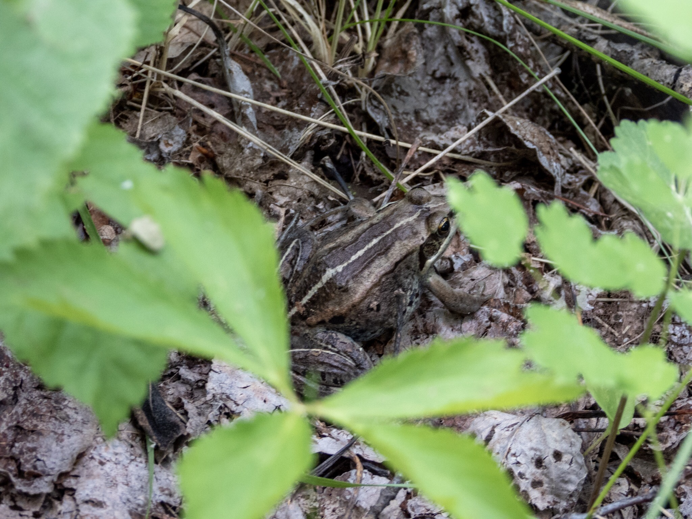

What is Project 366? Read more [here](https://thebirdsarecalling.com/2019/03/29/project-366/)!

Elk Island National Park is the home to two species of frogs; the wood frog (_Rana sylvatica_) and the Boreal Chorus Frog (_Pseudacris maculata_). I am not a frog expert by any means but I do believe that the white stripe down the middle of this fella means that it is a Wood Frog. We encountered sneaking about in the leaf litter as we were hiking the Simmons Trail. It was quite far away from the closest water source, but it has been raining a lot the last few weeks and the understory was very wet and muddy, so I imagine a frog is going to find it quite comfortable even on dry land under those conditions. The camouflage on this individual was quite remarkable as it blended in with the leaf litter perfectly.

Wood Frog (_Rana sylvatica_ ) at Elk Island National Park. June 23, 2019. Nikon P1000, 218mm @ 35mm, 1/60s, f/4.5, ISO 360

_May the curiosity be with you. This is from “The Birds are Calling” blog ([www.thebirdsarecalling.com](http://www.thebirdsarecalling.com)). Copyright Mario Pineda._
