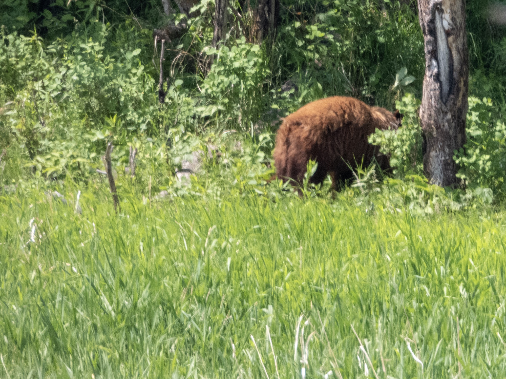

What is Project 366? Read more [here](https://thebirdsarecalling.com/2019/03/29/project-366/)!

Sometimes nature throws you for a loop of the least expected kind. As we were driving into the Bison Loop at Elk Island National Park I had barely finished mentioning that we would never encounter bears here when we, you guessed it, spotted a bear. We saw it clear as day meandering along the forest edge. I was so taken back that I did not even reach for the camera. As the bear turned around and started heading into the forest I came to my senses and drew the cameras in best Lucky Luke style and managed to take one single picture before the bear was gone. As far as a wildlife picture goes it is a pretty crappy picture with a somewhat fuzzy focus of the bears behind. Sure it would have been nice to get a better picture of the bear but for all intents and purposes this photo serves as a documentation of something I have believed was impossible, a bear encounter at Elk Island National Park. This park is the smallest national park in Canada and is, just as the name suggests, an island. This island is not, however, surrounded by water, but rather by farmers’ fields, roads, towns and cities. Even the official web page of Elk Island does not mention bears as one of the animals one might see. Further research revealed that bear sightings are reported once or twice a year. Considering the number of visitors the park gets (about 500000 in 2018), that is a very low number. So clearly the bears are there, but it is likely a small population. The various reaction people have to bear sightings are interesting. For example, my better half is now concerned with me heading out to the park alone in the mornings the way I have been doing over the last few months. I on the other hand, I am strategizing about how I can track down another bear in the park for a closer look. Considering the serendipity of our sighting I am really not sure how one could track down a bear in Elk Island, other than just continuing to visit the park as often as one is able to and hope for another chance encounter.

_Black Bear (Ursula americanus) at Elk Island National Park. June 23, 2019. Nikon P1000, 1109mm @ 35mm, 1/500s, f/5.6, ISO 320_

_May the curiosity be with you. This is from “The Birds are Calling” blog ([www.thebirdsarecalling.com](http://www.thebirdsarecalling.com)). Copyright Mario Pineda._
