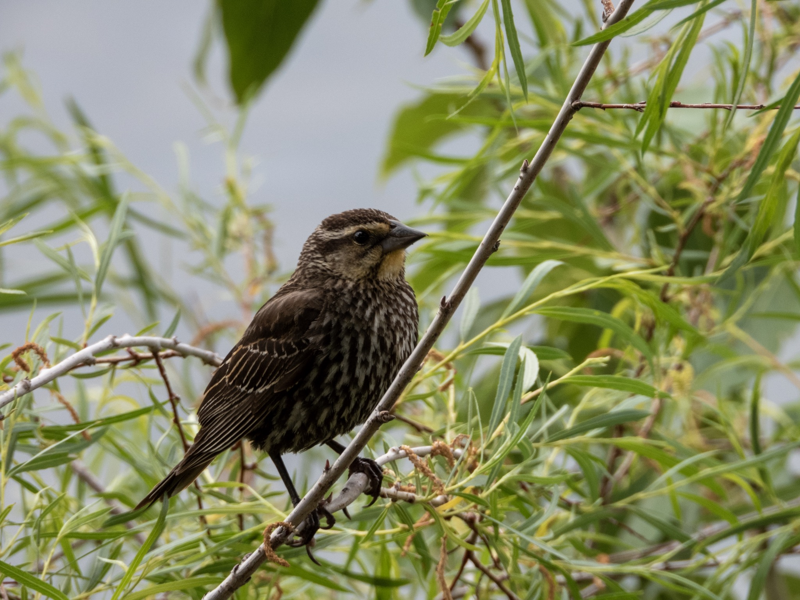

What is Project 366? Read more [here](https://thebirdsarecalling.com/2019/03/29/project-366/)!

I was standing at the edge of a small grassy patch by Lake Beaumaris. All around me there were a large number of Red-winged Blackbirds, Common Grackles and House Finches fluttering about in the shrubbery surround the lawn and on the lawn itself. None of the species were new, yet there was handful of odd looking individuals mixed in among all the usual suspects. They had the overall shape and color of a sparrow, except they were at least twice the size of any sparrow I know. Their beak, however, was decidedly non-sparrow-like. It had the distinct triangular shape of a blackbird..., yet there was not a speck of black on these individuals. I had my suspicions, but I was not sure and when I left I was still very much on the fence regarding the identification of these birds. I had lots of picture of them, so once I got home the research begun. After extensive online research and carefully study of Sibley I can only conclude that my suspicion was correct. These were female Red-winged Blackbirds. It is and odd phenomenon, male Red-winged Blackbirds are not only one of the easiest birds to identify both by look and sound, but also one of the most abundant species around ponds, wetland and marshes, yet paradoxically female Red-winged Blackbirds are nowhere to be seen. I had not put much thought into it previously, tacitly assuming that the females probably looked the same as a the male. I was, however wrong. While the females have a similar overall shape as the males, and their beak is certainly the same shape and size, not much else is similar. It is quite peculiar that while the male Red-winged Blackbirds were one of the first spring migrants I observed many months ago, and since then I have seen hundreds upon hundreds of them, it is only now that I came across the females. At this point I do not have the faintest idea of why the males are so abundant while the females are so rare. This will definatelly require more thinking and research to figure out what is going on.

_Female Red-winged Blackbird (Agelaius phoeniceus) at Beaumaris Lake. June 21, 2019. Nikon P1000, 146mm @ 35mm, 1/_250_s, f/5, ISO_ 140

_May the curiosity be with you. This is from “The Birds are Calling” blog ([www.thebirdsarecalling.com](http://www.thebirdsarecalling.com)). Copyright Mario Pineda._
