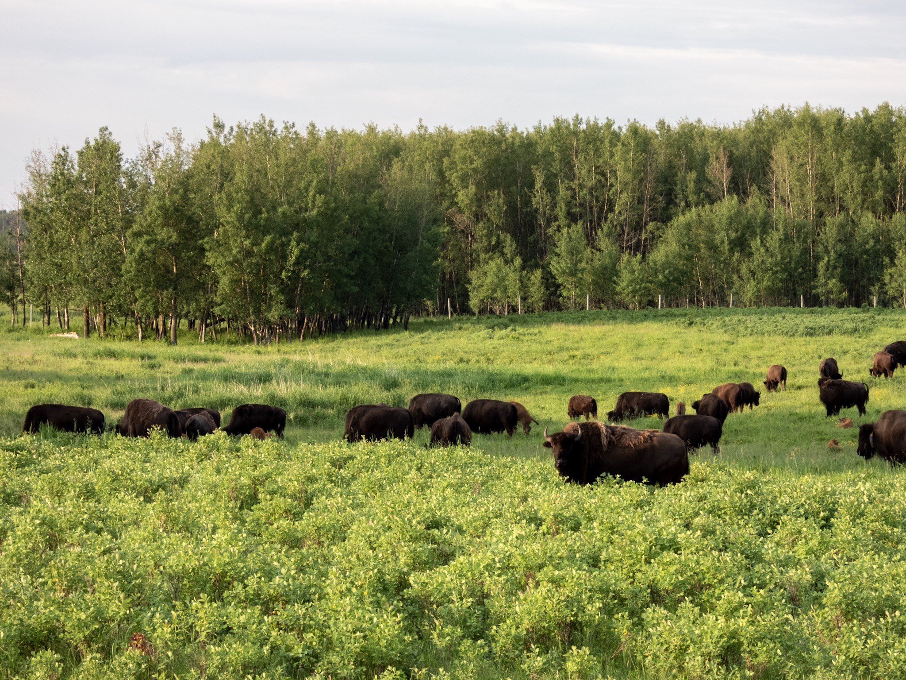

What is Project 366? Read more [here](https://thebirdsarecalling.com/2019/03/29/project-366/)!

‘Twas the morning before Canada Day, when all through the park not a human was stirring, only the bison. Well, it’s not that time of year yet (as a matter of fact, today is day 178 so we are exactly halfway there), but it sure felt like that time of year this morning. At 6 am I rolled into Elk Island National Park and as the Bison Loop emerged around a curve in the road, for a second, I though I was dreaming. The field surrounding the Bison Loop and Mud Lake was filled with bison. There must have been several hundreds of them. Adults, awkward and mangy looking teens and milk chocolate coloured calves dotted the grassy field, more bison were hiding in the tree groves, bison were blocking the road and the Bison Loop gravel road was a veritable traffic jam of bison. One of the collective nouns for bison is an obstinacy of bison (the other ones are a heard of bison, a gang of bison and a troop of bison). The term seems quite fitting to such a massive animal that clearly has the attitude that they can do whatever they want. If they decide to cross the road and stand in front of your vehicle, they will do just that. As I approached the Bison Loop I thought to myself, “if I drive into the loop, I will be stuck for who knows how long”. This is one traffic jam I would love to be in. Said and done, I drove into the loop and was soon surrounded by bison and stuck in my first bison traffic jam. A few hours later I emerged on the other side of the loop with tones of picture and unforgettable memories. It was almost as if I had travelled a few hundred years back in time to the heydays of the bison when an obstinacy of bison roamed the grasslands as far as they eye could see. Much more could be said about this experience, and I will say more..., expect the next few days to have a bison theme. Tomorrow is Canada Day and the plans are to spend the day in the great canadian outdoors at Elk Island with family and friends and, hopefully, another obstinacy of bison.

_An obstinacy of Plains Bison (Bison bison bison) at Elk Island National Park. June 30, 2019. Nikon P1000, 157mm @ 35mm, 1/125s, f/4, ISO_ 100

_May the curiosity be with you. This is from “The Birds are Calling” blog ([www.thebirdsarecalling.com](http://www.thebirdsarecalling.com)). Copyright Mario Pineda._
