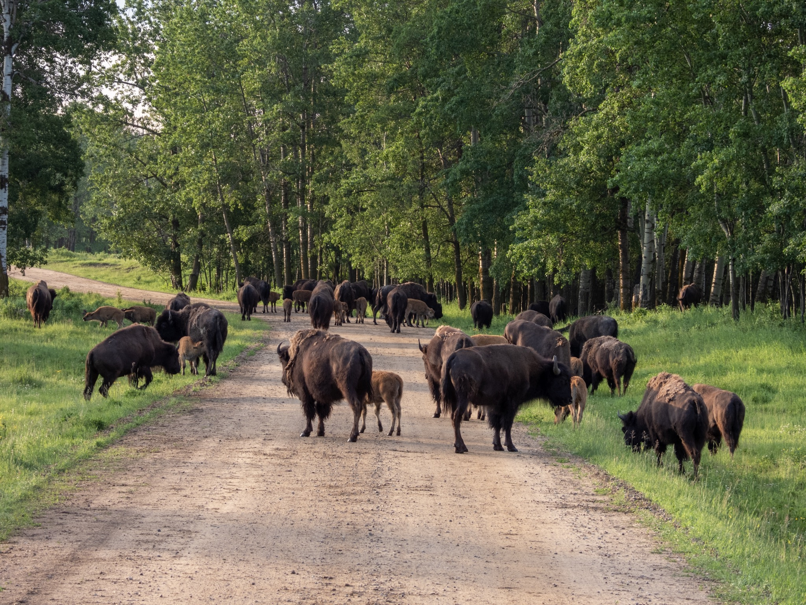

What is Project 366? Read more [here](https://thebirdsarecalling.com/2019/03/29/project-366/)!

So here is another bison post as promised yesterday. This was the view as I entered the Bison Loop at Elk Island National Park yesterday morning at 6 am. Those bison were in no hurry anywhere and took their sweet time. They were mainly just standing around, occasionally a few of them decided to lie down in the grass or on the dirt road. I was slowly inching my way along in my vehicle. Mostly I was standing still waiting for a few of the bison to lumber on. A few times I got too close and I got some dirty bison looks thrown my way. Clearly the message was, this is our turf and here we are the traffic.

Today is July 1 and other than it being Canada Day it also marks the half way point of my Alberta Big Year. 178 day down and 178 days left to go. My current tally is 114 species seen in Alberta since 00:01 January 1 this year. According to eBird 404 species of birds have been reported in Alberta since the beginning of times (or at least since the beginning of the eBird record). Looking at the species reported this year only, the number is 317. Clearly I have long ways to go to reach the stratosphere of birding in Alberta. I am hoping to boost this number by going to some targeted hotspots beyond Edmonton during the summer, e.g. Frank Lake and Inglewood Bird Sanctuary, both these locations are located in and around Calgary. Other than this, my bread and butter will be my two main field locations, the Whitemud Creek and Elk Island National Park. With 153 species recorded at Whitemud Creek and 243 species reported at Elk Island there are plenty more treasures waiting to be found.

_Bison traffic jam at the Bison Loop at Elk Island National Park. June 30, 2019. Nikon P1000, 157mm @ 35mm, 1/100s, f/4, ISO 100_

_May the curiosity be with you. This is from “The Birds are Calling” blog ([www.thebirdsarecalling.com](http://www.thebirdsarecalling.com)). Copyright Mario Pineda._
