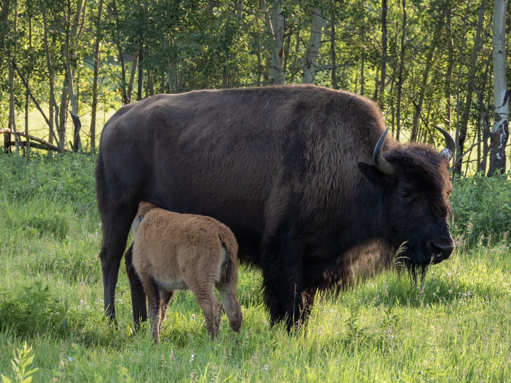

What is Project 366? Read more [here](https://thebirdsarecalling.com/2019/03/29/project-366/)!

At the edge of a grove, away from the melee, a lonely bison mom and her calf were having a moment. The reddish brown calf was quite assertive, pushing its head into the mom’s groin, clearly letting her know what it wanted. I was probably not more than 25 meters from them, stuck in a bison traffic jam in the Bison Loop at Elk Island National Park. Mom and calf seemed not to mind my presence at all. I opened the sunroof of the truck and climbed out with my camera. This vantage point gave me an unobstructed view of the surroundings. As I was observing mom and calf I was surprised when I realize that the cow had horns, something I had assumed only male bison would have. It turns out that the physical differences that distinguish males (bulls) from females (cows) are quite subtle so determining a bison’s sex is not entirely trivial. Clearly the presence of horns cannot be used to tell males and females apart. Although a cow’s horns are slightly more curved and slender than a bull’s, one would likely have to be quite experienced to be able to pick up on this. Obviously a bison feeding a calf is one sure-way of positively identifying a female.

_Mom and her calf at the Bison Loop at Elk Island National Park. June 30, 2019. Nikon P1000, 258mm @ 35mm, 1/125s, f/4.5, ISO 280_

_May the curiosity be with you. This is from “The Birds are Calling” blog ([www.thebirdsarecalling.com](http://www.thebirdsarecalling.com)). Copyright Mario Pineda._
