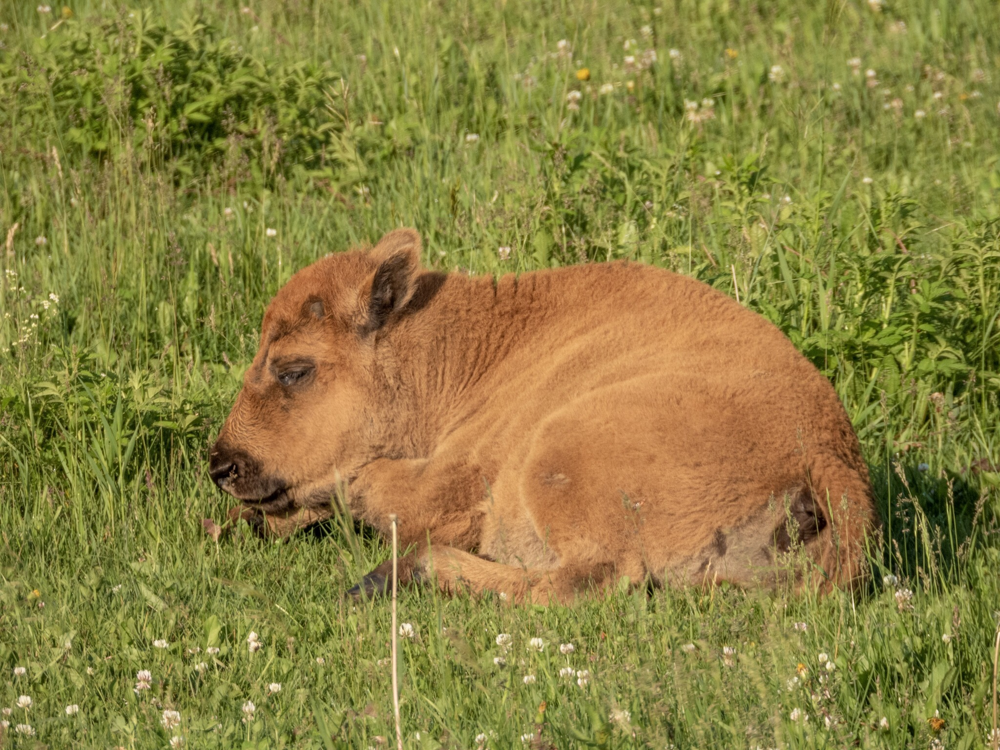

What is Project 366? Read more [here](https://thebirdsarecalling.com/2019/03/29/project-366/)!

Among the hundreds of bison covering the meadow I found this one calf that decided to take a snooze in the sunshine. It did not have a care in the world and was clearly oblivious to my presence. An adult bison walked by and deposited a bison sized turd a few feet from it’s head, but little bison baby just kept snoozing on. With coyotes, bears, vehicles and pooping bison around you think this youngster would be a tad more wary, but I guess if your mom is a half a tonne (500 kg = 1100 lbs) lady capable of running as fast as a horse, anyone even thinking of messing around with her precious baby would soon regret it and would probably not live to tell the tale. Since the bison were introduced at Elk Island National Park in 1907, over 100 generations of have been born and raised in the park. This calf was in the northern par of the park which means it is a Plains Bison. In the southern part of the park the Wood Bison live. It would be interesting to see some of their calves. Would they look different? That sounds like an exciting field trip; tracking down some Wood Bison calves.

_Plains Bison calf having a snooze at the Bison Loop at Elk Island National Park. June 30, 2019. Nikon P1000, 806mm @ 35mm, 1/500s, f/5.6, ISO 100_

_May the curiosity be with you. This is from “The Birds are Calling” blog ([www.thebirdsarecalling.com](http://www.thebirdsarecalling.com)). Copyright Mario Pineda._
