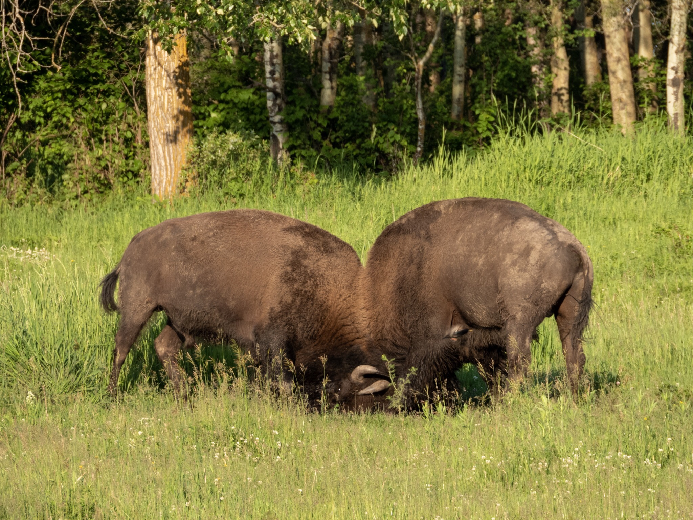

What is Project 366? Read more [here](https://thebirdsarecalling.com/2019/03/29/project-366/)!

While most of the bison on the meadow were pretty chilled and seemed to just enjoy the sunny morning a few of the males had other things in mind. These two males were ogling and sizing each other up. Just as it looked like they were about to walk away, they turns around and crashed their heads together. Their horns locked together and a twisting wrestling match ensued were the two bulls trekked to outmaneuver each other. This went on for a while when suddenly one of the bison lost his footing and crashed down on his side. He was back on his feat at once and they were back in staring competition mode. Bison bulls engage in head butting battles fort mating privileges. I am not sure when the mating season for the bison in Elk Island starts, but these males might be getting ready for it.

Male Plains Bison head butting at the Bison Loop at Elk Island National Park. June 30, 2019. Nikon P1000, 605mm @ 35mm, 1/250s, f/5, ISO 100

_May the curiosity be with you. This is from “The Birds are Calling” blog ([www.thebirdsarecalling.com](http://www.thebirdsarecalling.com)). Copyright Mario Pineda._
