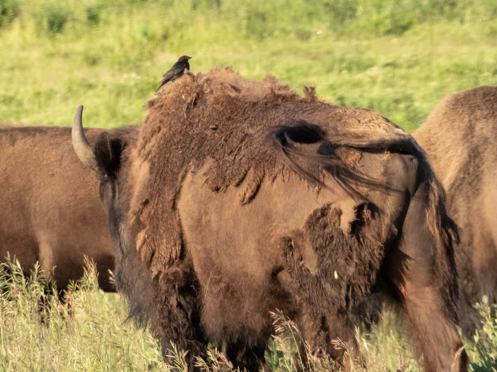

What is Project 366? Read more [here](https://thebirdsarecalling.com/2019/03/29/project-366/)!

Intermingled with the massive bison were these small brown birds that were mostly hiding in the tall grass and occasionally emerging and landing on the back of a bison before diving down into the grass again. These were Brown-headed Cowbirds (_Molothrus ater_), a species commonly associated with grazing animals. The tend to look for insects and seeds to eat on the ground stirred up by the larger animal. Before European settlement, the Brown-headed Cowbird followed bison herds across the plains. Because of their nomadic lifestyle they engage in brood parasitism laying their eggs in the nest of unsuspecting birds of other species. These days the species is commonly seen around domesticated livestock and at suburban bird feeders. At Elk Island, however, they still live their traditional lifestyle in close association with bison herds.

Brown-headed Cowbird (_Molothrus ater_) going for a ride on a Plains Bison at the Bison Loop at Elk Island National Park. June 30, 2019. Nikon P1000, 756mm @ 35mm, 1/500s, f/5.6, ISO 280

_May the curiosity be with you. This is from “The Birds are Calling” blog ([www.thebirdsarecalling.com](http://www.thebirdsarecalling.com)). Copyright Mario Pineda._
