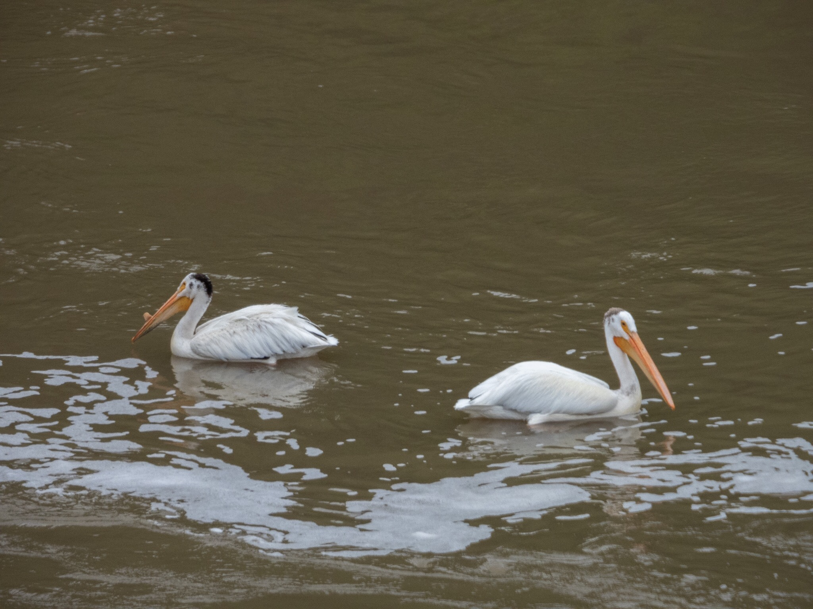

What is Project 366? Read more [here](https://thebirdsarecalling.com/2019/03/29/project-366/)!

Instead of a nature walk we went on a bike ride today in the Edmonton River Valley. Although no birding was part of the plan I did pack my binoculars and camera in the paniers, just in case we would bump into anything interesting. Sure enough, as we were approaching Quesnell Bridge I spotted these large white birds in the water along the opposite shore. There were not too many options as to what it could be. Five Americans White Pelicans were frolicking in the murky waters of the river. As we were crossing the bridge we got a closer look and I managed to take a few pictures from my high vantage point. This is the first time I have seen pelicans in the river and I guess, for a water bird, the river is probably as good of a place to hang out as any other body of water. Right along the shore where the pelicans were there were some people fishing. Perhaps the fishermen and the pelicans chosen the same location because it is a good fishing spot.

American White Pelicans by the Quesnell Bridge in the North Saskatchewan River in Edmonton. July 6, 2019. Nikon P1000, 1008mm @ 35mm, 1/500s, f/5.6, ISO 220

_May the curiosity be with you. This is from “The Birds are Calling” blog ([www.thebirdsarecalling.com](http://www.thebirdsarecalling.com)). Copyright Mario Pineda._
