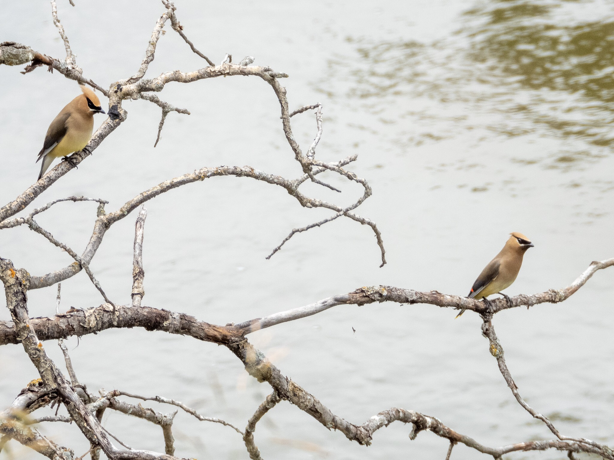

What is Project 366? Read more [here](https://thebirdsarecalling.com/2019/03/29/project-366/)!

I had dropped off my teen at practice, there was a break in the never ending rain and I had 90 minutes to myself. Dark clouds loomed at the horizon so there was no time to waste. I raced as fast as it was legal to the nearest birding spot, which happened to be the MacTaggard Sanctuary. The MacTaggard sancturary straddles the Whitemud Creek south of 23rd avenue. I have been here once before, about three weeks ago at which point I was almost eaten alive by the mosquitoes. ([See Post No. 078](http://thebirdsarecalling.com/2019/06/14/project-366-post-no-78-exploring-the-mactaggard-sanctuary/)) With the copious amounts of rain we have received over the last few weeks the mosquito situation has not improved. With the trail covered in mud and mushrooms sprouting all around in the soggy leaf litter I set out with my sights set on the oxbow lake situated in sanctuary ([See Post No. 075](https://thebirdsarecalling.com/2019/06/09/project-366-post-no-73-oxbow-in-the-making/) for an explanation of what an oxbow lake is). I never made it to the lake. First I got sidetracked by a fleeting glimpse of an American Goldfinch. I spend some time trying to get a better look at it but to no avail. Then I spotted a Pileated Woodpecker perched high up on a dead tree. As I was watching it another one landed on the same tree. You simply do not walk away from a duet of Pileated Woodpeckers, so I spend quite some time checking out these cool fellas. They were flying too and fro between trees and seemed to have a jolly good time together. Once I decided to move on something in the corner of my eye caught my attention as I hiked over a bluff overlooking the creek. I stopped and scanned the creek and the dense riparian vegetation below me. It took a while, but then I saw them. Five magnificent and regal Cedar Waxwings were playing hide and seek in the thick riparian vegetation with an occasional foray out into the open over the creek. Cedar Waxwings have been on my birding wanna-see list ever since the beginning of the year. Way back on March 29 my very first Project 366 post was about Bohemian Waxwings ([See Post No. 001](https://thebirdsarecalling.com/2019/03/29/project-366-post-no-001-a-gaggle-of-bohemian-waxwings/)). I ended seeing lots of Bohemian Waxwings along the Whitemud Creek as the winter petered out. The almost identical Cedar Waxwings, however, evaded me.., until today. The two species look almost identical and the physical differences between them are subtle. While Bohemian Waxwings are bigger and chunkier than Cedar Waxwings, for the uninitiated noob (like me) that does not really help. The key distinguishing feature for me was the orange under-tail of the Bohemian Waxwings versus the white under-tail of Cedar Waxwings. Today’s Cedar Waxwings brings my AB Big Year total to 115 and my Life list to 163. The last month has been a bit of a dry spell in terms of spotting new species as the birding has been a bit of hiatus in favour of a focus on bison. Hopefully the Cedar Waxwings are a sign of being back in the swing of things.

Cedar Waxwings (_Bombycilla cedrorum_) at the MacTaggard Sanctuary, Edmonton. July 7, 2019. Nikon P1000, 538mm @ 35mm, 1/250s, f/5, ISO 125

_May the curiosity be with you. This is from “The Birds are Calling” blog ([www.thebirdsarecalling.com](http://www.thebirdsarecalling.com)). Copyright Mario Pineda._
