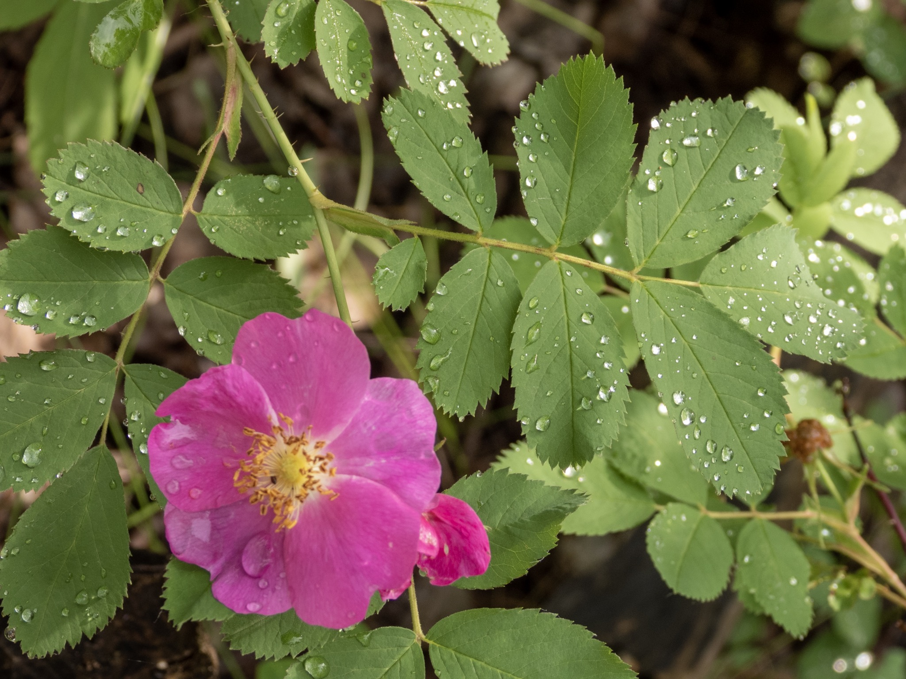

What is Project 366? Read more [here](https://thebirdsarecalling.com/2019/03/29/project-366/)!

If your look around the forest after a rain, you might notice that some leaves shed the water readily and appear dry while on other leaves the water pools in droplets. Leaves are covered in a waxy cuticle and the structure and chemistry of the cuticle determines how water on its surface behaves. The stronger the water is repelled from the surface of the leave the larger and more dome shaped the water droplets on the leaves are. It is the cohesive intermolecular forces between the water molecules (specifically the hydrogen bonds between water molecules) that result in surface tension That ultimately form the spherical shape. There is probably a lot more that could be said about this phenomenon but suffice to say that is quite photogenic.

_Water droplets on a Prickly Wild Rose (Rosa acicularis) at the MacTaggard Sanctuary, Edmonton. July 7, 2019. Nikon P1000, 134mm @ 35mm, 1/200s, f/4, ISO 1_00

_May the curiosity be with you. This is from “The Birds are Calling” blog ([www.thebirdsarecalling.com](http://www.thebirdsarecalling.com)). Copyright Mario Pineda._
