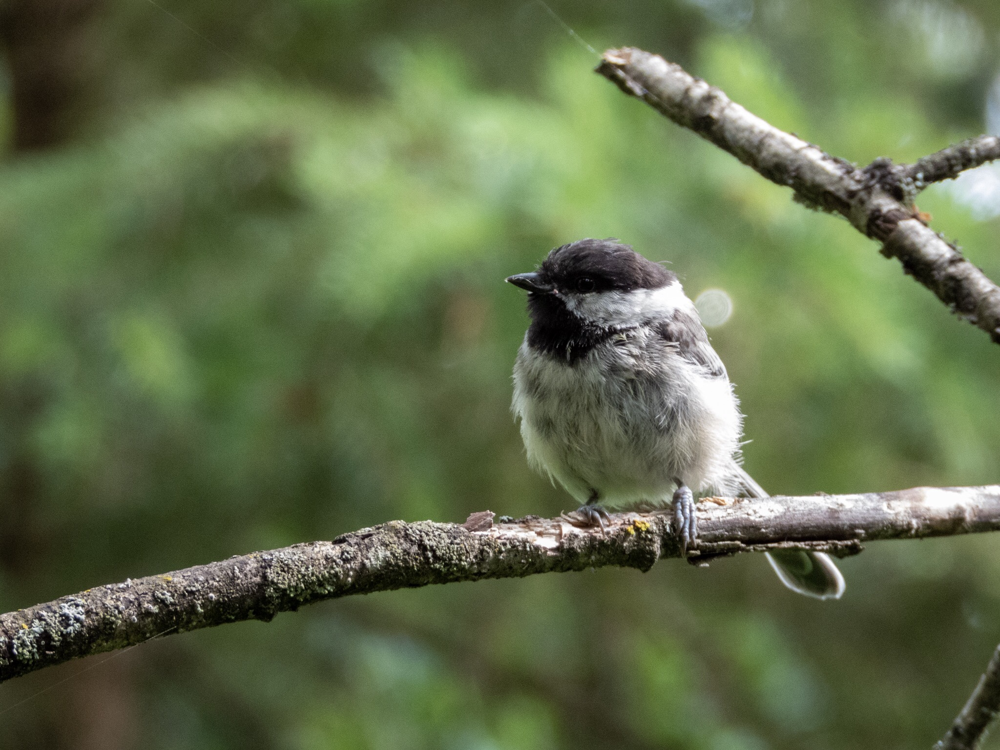

What is Project 366? Read more [here](https://thebirdsarecalling.com/2019/03/29/project-366/)!

Came across the unusually fuzzy looking Black-capped Chickadee at the MacTaggard Sanctuary the other day. This chickadee looked bedraggled and mottled , like it was having a bad hair feather day. I have my suspicions that’s perhaps it could bear a juvenile, but I have not been able to find any conclusive information supporting my theory. During the winter the chickadees were very abundant and as soon as one would arrive at the trail, the chickadees would greet you, probably hoping for a treat. During the summer the situation is quite different. While one can hear their song in the forest they keep to them selves and rarely accost unsuspecting humans. This disheveled looking chickadee, however, came down to check me out. It did not stray long. Once it was clear that I was not offering any treats it took off and vanished in the shrubbery again.

_Fuzzy Black-capped Chickadee (Poecile atricapillus) at the MacTaggard Sanctuary, Edmonton. July 7, 2019. Nikon P1000, 504mm @ 35mm, 1/160s, f/5, ISO 400_

_May the curiosity be with you. This is from “The Birds are Calling” blog ([www.thebirdsarecalling.com](http://www.thebirdsarecalling.com)). Copyright Mario Pineda._
