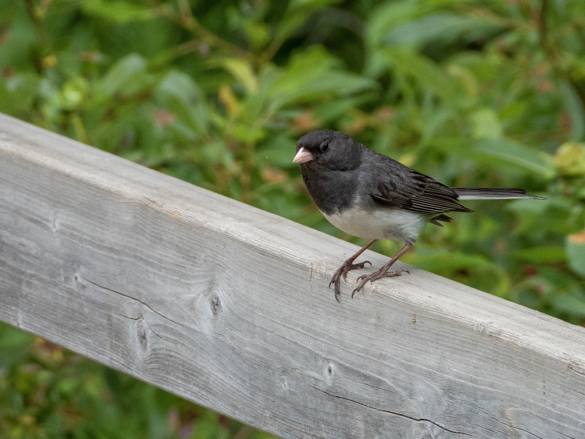

What is Project 366? Read more [here](https://thebirdsarecalling.com/2019/03/29/project-366/)!

As we made our way along the Whitemud Creek I was struck by how much everything everything has changed since the last time I was here, about six weeks ago. Edmonton has received lots of rain over the last month and the vegetation has grown like crazy. Locations that had an unobstructed view of the creek six weeks ago are not completely overgrown with dense shrubbery and understory. The Great Horned Owl family (mom, dad and two chicks) have move on and it appears that their cavity now is uninhabited. The Least Chipmunks are out in full fore scurrying around along the creek wherever one turns. We also saw quite a few Dark-eyed Juncos that were quite curious about our activities. Although we spend some time looking (and listening) for Pileated Woodpeckers it was not until we got back to the parking lot that a large individual made a bee-line across the parking lot and into the forest. As soon as it was out of sight it let loose it’s characteristic vocalizations that sounds like a hysterically laughing monkey.

_Dark-eyed Junco (Junco hyemalis) at the Whitemud Ravine, Edmonton. July 9, 2019. Nikon P1000, 437mm @ 35mm, 1/250s, f/5, ISO 110_

_May the curiosity be with you. This is from “The Birds are Calling” blog ([www.thebirdsarecalling.com](http://www.thebirdsarecalling.com)). Copyright Mario Pineda._
