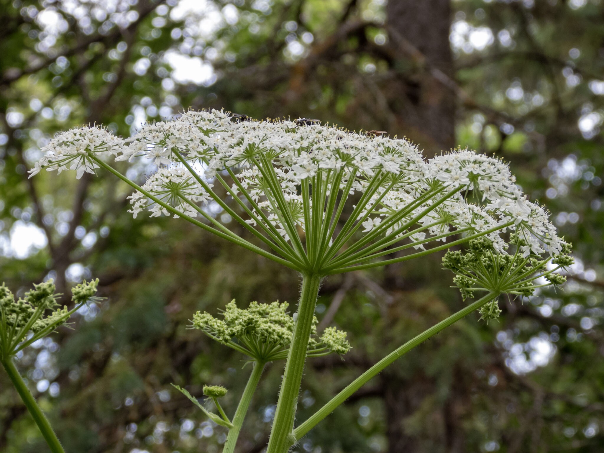

What is Project 366? Read more [here](https://thebirdsarecalling.com/2019/03/29/project-366/)!

As we were approaching the parking lot at the Savage Centre by the Whitemud Ravine my teen suddenly said “That looks like a Giant Hogweed”. His words made me stop in in my tracks. The statement was remarkable in the first place? How would a run of the mill teen know of Giant Hogweed? Secondly, Giant Hogweed has not been found in Alberta (yet) and finding its here would be unprecedented and very bad news indeed. Giant Hogweed (_Heracelum mantegazzianum_) is native to Eurasia. It was introduced in North America as an ornamental plant and soon started to throughout the continent. As if that would not be bad enough, the really bad news is that it is that the weed is highly noxious as the sap causes severe burns, blistering and scarring and even blindness if it gets in the eyes. There is plenty of graphic images online of the horrific damage the plant causes to skin (Google it at your own risk). It is [considered as one of Canada’s most dangerous plants](https://www.google.com/amp/s/globalnews.ca/news/4291662/hogweed-plant-warning-canada/amp/) and has, to date, been found in the Atlantic provinces, Quebec, Ontario and British Columbia. According to [Alberta Agriculture and Forestry](https://www.strathcona.ca/agriculture-environment/plants/weeds/giant-hogweed-or-cow-parsnip/) the plant has not been found in Alberta yet and all plants reported as possible Giant Hogweed in Alberta have turned out to be Cow Parsnip. The plants belong to the same family and look very similar. The Giant Hogweed is sometimes even referred to by the name Cow Parsnip. The key difference between the plants though is that Cow Parsnip is harmless. We learned a lot that afternoon as we carefully inspected and photographed the plant. I still don’t know, however, where my teen learned about the Giant Hogweed.

Cow Parsnip (_Heracleum maximum_) at the Whitemud Ravine, Edmonton. July 9, 2019. Nikon P1000, 146mm @ 35mm, 1/80s, f/4, ISO 100

_May the curiosity be with you. This is from “The Birds are Calling” blog ([www.thebirdsarecalling.com](http://www.thebirdsarecalling.com)). Copyright Mario Pineda._
