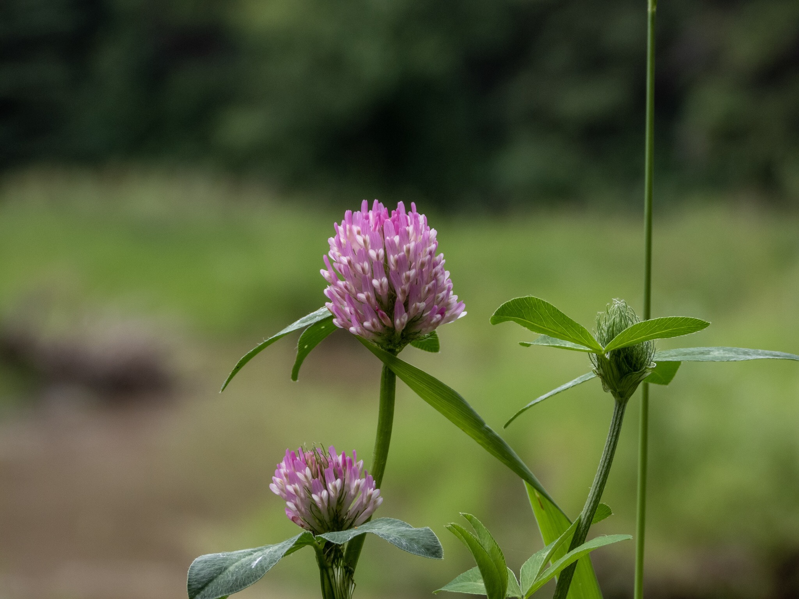

What is Project 366? Read more [here](https://thebirdsarecalling.com/2019/03/29/project-366/)!

This time of year, middle of summer by central Alberta standards, any open meadow at the Whitemud Ravine has lots of Red Clover (_Trifolum pratense_) covering it. The bumble bees seem to like it and apparently [all parts of the plant are edible](https://northernbushcraft.com/topic.php?name=clover&region=ab&ctgy=edible_plants), but can cause bloating and apparently should not be eaten in the fall as the plant accumulates alkaloids. It is native to Europe, Western Asia and northwestern Africa, but has been introduced to various part of the world and is now common through the americas. It has a pretty flower and is quite photogenic. This picture was taken on an embankment by the creek, which can sort of be seen in the blurry background.

Red Clover (_Trifolium pratense_) at the Whitemud Ravine, Edmonton. July 9, 2019. Nikon P1000, 218mm @ 35mm, 1/320s, f/4.5, ISO 100

_May the curiosity be with you. This is from “The Birds are Calling” blog ([www.thebirdsarecalling.com](http://www.thebirdsarecalling.com)). Copyright Mario Pineda._
