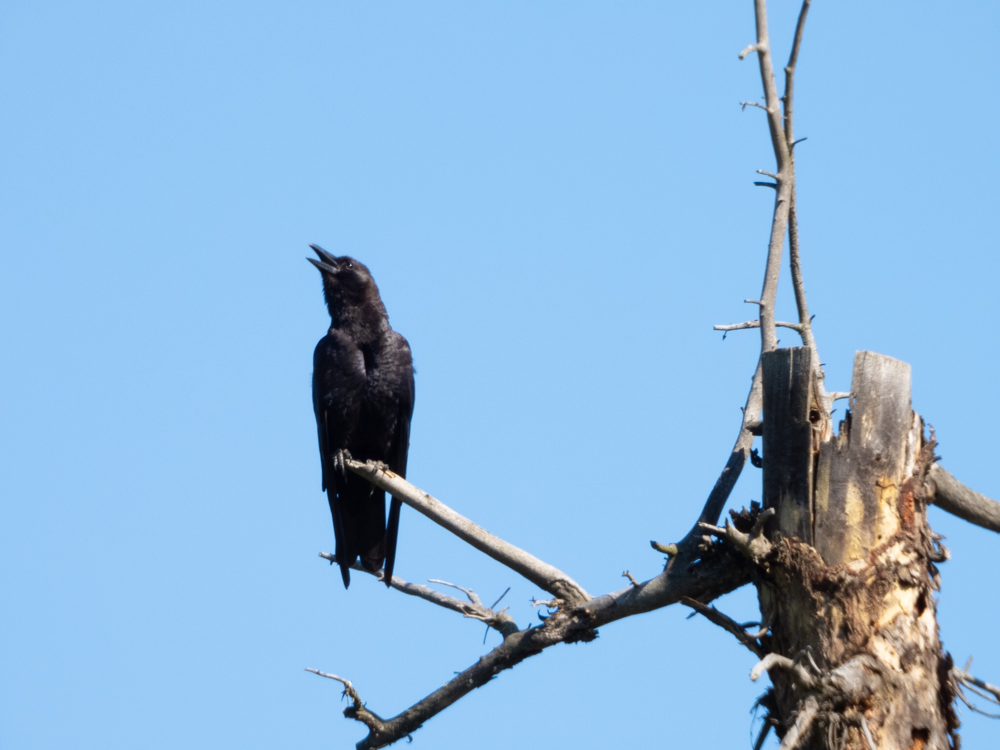

What is Project 366? Read more [here](https://thebirdsarecalling.com/2019/03/29/project-366/)!

The sun was out today and by noon is was getting quite hot. Going birding at noon on a hot day is probably not the best timing, but sometimes you just have to take what you get. As we were about to enter the shaded forest around the creek I noticed a crow in a tall snag. It was not moving and was perched in peculiar posture. As I zoomed in on it it still did not move. I shot several pictures of it and it was completely frozen, with its head turned up and its bill slightly open. It almost looked as if it was panting, except I was not able to see any panting motion. Once I came home I did some research. My hunch was that it could have been a form of thermoregulation to cool down and avoid overheating. Apparently birds do pant to keep cool and get rid of excess heat. The behaviour is referred to as gulag fluttering where the bird rapidly flaps membranes below the bill to increase evaporative cooling. Looking at videos of gulag fluttering confirms that the beak is partially open the way the crow had it and one can usually see the fluttering in the throat right below the beak. While it is possible that this crow was doing gulag fluttering I did not see the fluttering movement of the skin. I was quite far away though and, at the time, I did not know to look for it.

American Crow (_Corvus brachyrhychos_) at the Whitemud Ravine, Edmonton. July 13, 2019. Nikon P1000, 1008mm @ 35mm, 1/125s, f/8, ISO 100

_May the curiosity be with you. This is from “The Birds are Calling” blog ([www.thebirdsarecalling.com](http://www.thebirdsarecalling.com)). Copyright Mario Pineda._
